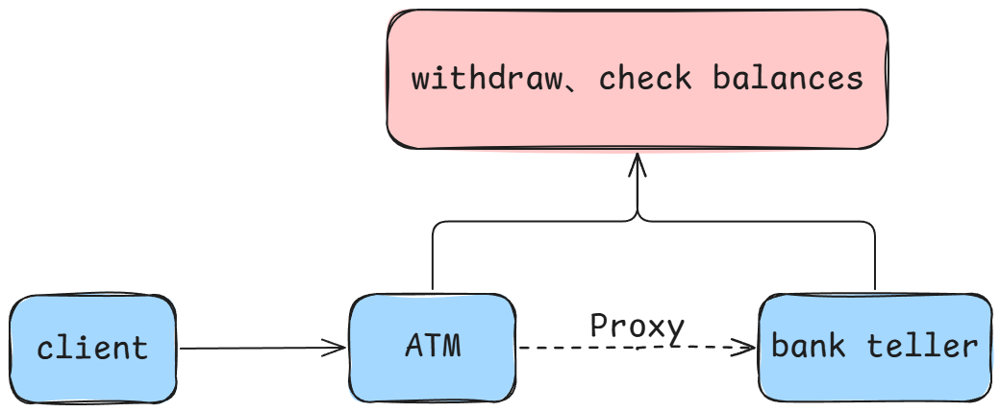

## 1. Overview

The Proxy Pattern is a structural design pattern that allows one object (the proxy) to act on behalf of another object (the real object) to control access to it.



A very relatable example is found in banking: we can conduct various transactions through a bank teller (real object), but we can also perform withdrawals, check balances, and more via an ATM (proxy). In this case, the ATM serves as the proxy. It represents the bank and provides services on its behalf, so we don't need to interact directly with the bank teller. The ATM manages our access to the bank account, ensuring all operations are secure.


## 2. Categories

In Java, the Proxy Pattern is primarily divided into **Static Proxy** and **Dynamic Proxy** (**JDK Dynamic Proxy** and **CGLIB Dynamic Proxy**).

**Static Proxy in Java**:

The **Static Proxy Pattern** involves creating a proxy class at compile time to enhance the functionality of the target object. The core idea is that **both the proxy class and the target class implement the same interface, and the proxy class adds additional logic before and after invoking the target class's methods**.

**Dynamic Proxy in Java**:

The **Dynamic Proxy Pattern** is a design pattern where proxy objects are dynamically generated at runtime, enhancing functionality without modifying the original class code. Unlike static proxies, **dynamic proxies do not require writing a separate proxy class for each interface or class; instead, they rely on reflection mechanisms to create proxy objects during runtime**.


## 3. Static Proxy

**Features of Static Proxy**:

- **Proxy class is determined at compile time**: The proxy class and the target class are defined and established during the compile phase.
- **Enhances the functionality of the target object**: The proxy class can insert additional logic before and after invoking the target object’s methods.
- **Depends on interfaces**: Static proxy typically requires both the target class and the proxy class to implement the same interface.


Example Using **Bank Counter (Real Object)** and **ATM (Proxy)** to Implement Static Proxy: 

**Define the Bank Service Interface**: 

The `BankService` interface outlines two core banking operations: withdrawing money (`withdraw`) and checking balance (`checkBalance`).

```java
public interface BankService {
    void withdraw();  // Withdraw money
    void checkBalance();  // Check account balance
}
```
{: .nolineno}

**Implement the Bank Counter Class (Real Object)**: 

The `BankCounter` class provides the actual implementation of the `BankService` interface. It represents the real object that handles withdrawals and balance inquiries.

```java
public class BankCounter implements BankService {
    private double balance;

    public BankCounter(double initialBalance) {
        this.balance = initialBalance;
    }

    @Override
    public void withdraw() {
        System.out.println("Withdrawal successful!");
    }

    @Override
    public void checkBalance() {
        System.out.println("Current balance: " + balance);
    }
}
```
{: .nolineno}


**Implement the ATM Machine (Proxy Object)**:

The `ATM` class also implements the `BankService` interface but serves as a proxy. It delegates the actual operations to the `BankCounter` class while adding extra functionality or controls.

```java
public class ATM implements BankService {
    private BankCounter bankCounter;

    public ATM(BankCounter bankCounter) {
        this.bankCounter = bankCounter;
    }

    @Override
    public void withdraw() {
        System.out.println("Proxy: Withdrawal");
        bankCounter.withdraw();
    }

    @Override
    public void checkBalance() {
        System.out.println("Proxy: Checking balance");
        bankCounter.checkBalance();
    }
}
```
{: .nolineno}


**Using Static Proxy**:

The client interacts with the `ATM` (proxy) instead of directly accessing the `BankCounter` (real object). This ensures the proxy manages interactions and adds additional logic as needed.

```java
public class Client {
    public static void main(String[] args) {
        BankCounter bankCounter = new BankCounter(1000);  // Real object with initial balance

        ATM atm = new ATM(bankCounter);  // Proxy object

        atm.checkBalance();  // Use proxy to check balance
        atm.withdraw();  // Use proxy to withdraw money
    }
}
```
{: .nolineno}


**Output**:

```
Proxy: Checking balance
Current balance: 1000.0
Proxy: Withdrawal
Withdrawal successful!
```
{: .nolineno}


**Advantages of Static Proxy**:

1. **Single Responsibility Principle**: Proxy objects control access to the real objects, while real objects focus solely on business logic.
2. **Enhanced Functionality**: Extra logic (e.g., logging or security checks) can be added without modifying the real object.


**Disadvantages of Static Proxy**:

1. **Code Redundancy**: A separate proxy class must be written for each target class. For numerous interfaces or classes, this can become cumbersome.
2. **Poor Scalability**: Any change in the interface requires updates in both the real and proxy classes, leading to higher maintenance costs.


---


## 4. JDK dynamic proxy

**JDK Dynamic Proxy** is a mechanism in Java to create proxy objects dynamically at runtime. This approach requires the target object to implement one or more interfaces. With JDK dynamic proxies, additional functionality can be introduced to method invocations without modifying the original class.	

- **`java.lang.reflect.Proxy` Class**
  The `Proxy` class is responsible for creating proxy instances dynamically.
- **`java.lang.reflect.InvocationHandler` Interface**
  The `InvocationHandler` interface defines the logic to handle method calls on proxy instances.


**Steps to Implement JDK Dynamic Proxy**: 

1. **Define an Interface**
   Both the target (real) object and the proxy object must implement this interface.
2. **Implement the Target Class**
   The target class implements the interface and contains the actual business logic.
3. **Create the Proxy Object**
   Use the `Proxy` class to generate a proxy object at runtime.
4. **Implement the InvocationHandler**
   Define a class that implements `InvocationHandler` and specifies how method calls should be handled.


### 4.1 Proxy Class

The `Proxy` class, part of the `java.lang.reflect` package, is the cornerstone of implementing dynamic proxies in Java. It enables the creation of proxy instances for specified interfaces at runtime. These proxy instances delegate method calls to an implementation of the `InvocationHandler` interface, which contains the logic for handling the method invocation.

#### newProxyInstance() Method

The `newProxyInstance()` method is the most commonly used method of the `Proxy` class. It dynamically generates a proxy class that implements the specified interfaces and returns an instance of this proxy class.

```java
public static Object newProxyInstance(ClassLoader loader, Class<?>[] interfaces, InvocationHandler h) throws IllegalArgumentException {
    Objects.requireNonNull(h);
    final Class<?>[] intfs = interfaces.clone();
    final SecurityManager sm = System.getSecurityManager();
    if (sm != null) {
        checkProxyAccess(Reflection.getCallerClass(), loader, intfs);
    }
}
```
{: .nolineno}


**Parameters**: 

- **`ClassLoader loader`**
   The class loader to define the proxy class. This is typically the class loader of the target class or the current class.
   - The proxy class must be defined by a class loader that can access all the specified interfaces.
   - Commonly used value: `this.getClass().getClassLoader()`.
- **`Class<?>[] interfaces`**
   An array of `Class` objects specifying the interfaces the proxy class must implement.
   - The proxy instance will delegate all method calls from these interfaces to the `InvocationHandler`.
- **`InvocationHandler h`**
   An instance of a class implementing the `InvocationHandler` interface, which handles method calls on the proxy instance.
   - The logic for processing method calls is defined in the `invoke` method of this handler.


**Return Value**: 

- Returns a dynamically generated proxy instance.
- The proxy instance implements the specified interfaces.
- Method invocations on the proxy instance are routed to the `InvocationHandler`.

```java
Proxy.newProxyInstance(this.getClass().getClassLoader(), target.getClass().getInterfaces(), this);
```
{: .nolineno}


### 4.2 InvocationHandler Interface

The `InvocationHandler` interface, located in the `java.lang.reflect` package, is the core component of Java's dynamic proxy mechanism. It defines how method calls on a proxy object are handled. When a method is invoked on a proxy object, the call is forwarded to the `invoke` method of the `InvocationHandler`.

**Interface Definition**:

```java
public interface InvocationHandler {
    public Object invoke(Object proxy, Method method, Object[] args) throws Throwable;
}
```
{: .nolineno}


#### invoke() Method

The `invoke` method is the sole method of the `InvocationHandler` interface. It specifies the behavior of a proxy instance when its methods are called.

**Parameters**: 

- **`proxy`**: The proxy instance that the method was invoked on.
   - This parameter is rarely used directly but can be helpful in specific scenarios, such as debugging or validating the proxy object.
-  **`method`**: The `Method` object representing the method being called.
   - It provides metadata about the method, such as its name, return type, and parameter types.
   - This can be used to identify the method and implement method-specific logic.
-  **`args`**: An array of objects containing the arguments passed to the method.
   - If the method takes no parameters, `args` is `null`.


**Return Value**: 

- The value returned by the `invoke` method becomes the return value of the proxy method invocation.
- If the proxy method is declared with a `void` return type, the `invoke` method should return `null`.


**Still using the `Bank Counter (Real Object)` and `ATM (Proxy)` example to implement JDK dynamic proxy**:

Define the bank service interface and implement the bank counter class (real object) the same as in the static proxy example. 

The main focus is on how to dynamically create proxy objects at runtime using the `Proxy` class and the `InvocationHandler` interface.


- **Implementing the core functionality of JDK dynamic proxy**

First, use the `setTarget()` method to pass a target object, which is the real object we want to proxy. Then, use the `getProxy()` method to dynamically generate a proxy object using `Proxy.newProxyInstance()`. This proxy object implements the same interfaces as the target object. When we invoke a method on the proxy object, it triggers the `invoke()` method in the `InvocationHandler`. The proxy object doesn’t directly execute the target object’s method but first goes through `invoke()`, where additional logic can be added. Inside the `invoke()` method, the real method on the target object is called using reflection (`method.invoke(target, args)`) and the result is returned.

```java
public class ProxyInvocationHandler implements InvocationHandler {
    private Object target;  // Target object, generalized as Object for better reusability
    
    public void setTarget(Object target) {  // Set the target object
        this.target = target;
    }
    
    public Object getProxy() {  // Dynamically generate proxy object
        return Proxy.newProxyInstance(
            this.getClass().getClassLoader(), 
            target.getClass().getInterfaces(), 
            this
        );
    }
    
    @Override
    public Object invoke(Object proxy, Method method, Object[] args) throws Throwable {  // Triggered when a proxy method is called
        printMessage();
        Object result = method.invoke(target, args);  // Use reflection to call the real method
        return result;
    }
    
    public void printMessage() {
        Date currentTime = new Date();
        System.out.println("ATM proxy service time: " + currentTime.toString());
    }
}
```
{: .nolineno}


- **Using JDK dynamic proxy**

```java
public class Client {
    public static void main(String[] args) {
        BankCounter bankCounter = new BankCounter(1000);  // Create the real object

        ProxyInvocationHandler handler = new ProxyInvocationHandler();  // Create the proxy handler

        handler.setTarget(bankCounter);  // Set the real object to be proxied

        BankService atmProxy = (BankService) handler.getProxy();  // Obtain the proxy object

        atmProxy.checkBalance();  // Call methods on the proxy object

        atmProxy.withdraw();
    }
}
```
{: .nolineno}

```
ATM proxy service time: Mon Oct 14 10:48:20 CST 2024
Current balance: 1000.0
ATM proxy service time: Mon Oct 14 10:48:20 CST 2024
Withdrawal successful!
```
{: .nolineno}


**Advantages**:

1. **No additional libraries required**: Relies only on JDK’s built-in `java.lang.reflect.Proxy` class.
2. **Dynamic behavior at runtime**: Methods can be intercepted and extended flexibly without modifying the original class.
3. **Reusable logic**: Common cross-cutting concerns (e.g., logging, security checks) can be encapsulated in the proxy.

**Disadvantages**:

1. **Limited to interface-based proxies**: Only interfaces can be proxied; classes without interfaces cannot be proxied.
2. **Performance overhead**: Method invocation relies on reflection (`Method.invoke`), which is slower compared to direct method calls.


## 5. CGLIB Dynamic Proxy

**CGLIB Dynamic Proxy** is a mechanism in Java for creating proxies by manipulating bytecode at the class level. Unlike JDK dynamic proxies, which require the target class to implement interfaces, CGLIB can proxy classes directly by creating a subclass of the target class and overriding its methods for enhancement.

**Features**：

- **No Interface Requirement**: CGLIB proxies can be created for classes that do not implement interfaces, unlike JDK dynamic proxies.
- **Inheritance-Based**: CGLIB creates a subclass of the target class to act as the proxy. As a result, the target class cannot be `final`.
- **High Performance**: CGLIB is generally faster than JDK dynamic proxies for method-heavy use cases since it operates at the bytecode level.


**Dependencies**:

Add the following Maven dependency to use CGLIB:

```xml
<dependency>
    <groupId>cglib</groupId>
    <artifactId>cglib</artifactId>
    <version>3.3.0</version>
</dependency>
```
{: .nolineno}


**Target Class**: 

Here, `BankCounter` is the target class, which does not implement any interfaces:

```java
public class BankCounter {
	public void checkBalance() {
        System.out.println("Check balance")
    }
    
    public void withdraw(int amount) {
        System.out.println("Withdrawing " + amount + " from bank");
    }
}
```
{: .nolineno}


**Proxy Class**:

The proxy class uses CGLIB's `Enhancer` to generate a proxy object. The `intercept` method is the core, where additional logic (e.g., logging) can be added before or after invoking the real method.

```java
import org.springframework.cglib.proxy.Enhancer;
import org.springframework.cglib.proxy.MethodInterceptor;
import org.springframework.cglib.proxy.MethodProxy;
import java.lang.reflect.Method;
import java.util.Date;

public class ProxyMethodInterceptor implements MethodInterceptor {
    private Object target;

    public void setTarget(Object target) {
        this.target = target;
    }

    public Object getProxy() {
        Enhancer enhancer = new Enhancer();
        enhancer.setSuperclass(target.getClass());  // Set the superclass to the target class
        enhancer.setCallback(this);  // Set this interceptor as the callback
        return enhancer.create();  // Create and return the proxy object
    }

    @Override
    public Object intercept(Object obj, Method method, Object[] args, MethodProxy methodProxy) throws Throwable {
        printMessage();
        System.out.println("Method called: " + method.getName());
        Object result = methodProxy.invokeSuper(obj, args);  // Call the real method
        return result;
    }

    public void printMessage() {
        Date currentTime = new Date();
        System.out.println("ATM proxy service time: " + currentTime.toString());
    }
}
```
{: .nolineno}


**Using CGLIB Dynamic Proxy**: 

```java
public class Client {
    public static void main(String[] args) {
        BankCounter bankCounter = new BankCounter();  // Create target object

        ProxyMethodInterceptor interceptor = new ProxyMethodInterceptor();
        interceptor.setTarget(bankCounter);  // Set the target object

        BankCounter proxy = (BankCounter) interceptor.getProxy();  // Create proxy object

        proxy.checkBalance();  // Call proxy methods
        proxy.withdraw(100);
    }
}
```
{: .nolineno}


**Output**:

```
ATM proxy service time: Mon Oct 14 15:38:02 CST 2024
Method called: checkBalance
Checking balance...
ATM proxy service time: Mon Oct 14 15:38:02 CST 2024
Method called: withdraw
Withdrawing 100 from the bank.
```
{: .nolineno}


**Advantages**: 

1. **Supports non-interface classes**: More flexible than JDK dynamic proxies as it can proxy classes without interfaces.
2. **Performance**: Better suited for use cases involving frequent method calls due to its bytecode-level optimizations.


**Disadvantages**: 

1. **Dependency on CGLIB**: Requires an external library, unlike JDK proxies.
2. **Cannot proxy `final` classes**: Since CGLIB relies on subclassing, `final` classes cannot be proxied.
3. **Cannot proxy `final` methods**: Methods marked as `final` in the target class are excluded from proxying.


## 6. Differences Between JDK and CGLIB Dynamic Proxies

### 6.1 Requirement for Interfaces

**JDK Dynamic Proxy**:
Relies on the `java.lang.reflect.Proxy` class, which generates a proxy class that implements the target class's interfaces. Therefore:

- **Requirement**: The target class **must implement an interface** for the proxy to work.
- **Limitation**: Cannot proxy classes that do not implement any interfaces.

**CGLIB Dynamic Proxy**:
Uses inheritance to create a proxy by generating a subclass of the target class. Therefore:

- **Requirement**: Does **not require interfaces**.
- **Limitation**: The target class **cannot be final** because it needs to be subclassed.


### 6.2 Proxy Generation Mechanism

**JDK Dynamic Proxy**:
Proxies are generated using the `java.lang.reflect.Proxy` class. The `ProxyGenerator` utility creates bytecode for the proxy class at runtime and loads it into the JVM.

**CGLIB Dynamic Proxy**:
Uses the **ASM framework** for bytecode manipulation. ASM operates at a lower level, enabling CGLIB to directly generate the bytecode of the proxy class, which is a subclass of the target class.

- The proxy class overrides non-`final` methods to add additional logic.


### 6.3 Handling `final` Classes and Methods

- **JDK Dynamic Proxy**:
  Works on interfaces and uses reflection to invoke methods, so it is not affected by `final` methods or classes.
  - **Supports** proxying methods marked as `final`.
- **CGLIB Dynamic Proxy**:
  Relies on inheritance to generate the proxy class. Therefore:
  - **Cannot proxy `final` classes** because they cannot be subclassed.
  - **Cannot proxy `final` methods** because they cannot be overridden.


### 6.4 Method Invocation Mechanism

**JDK Dynamic Proxy**:

- When a proxy method is invoked, the call is intercepted by the `InvocationHandler.invoke()` method.
- This method uses reflection (`Method.invoke()`) to call the actual method on the target object.

**CGLIB Dynamic Proxy**:

- When a proxy method is invoked, the call is intercepted by the `MethodInterceptor.intercept()` method.

- CGLIB employs the `FastClass` mechanism to avoid reflection overhead:

  - **`FastClass`**: Generates an indexed method map at runtime for both the proxy class and the target class.
  - This allows method invocation using indices rather than reflection, which is faster.
  - The real method is invoked via `MethodProxy.invokeSuper()`.


### 6.5 Number of Auto-Generated Classes

**JDK Dynamic Proxy**:

- Generates a **single proxy class** that implements the target object's interfaces.
- Method invocations are handled directly using the `invoke()` method.

**CGLIB Dynamic Proxy**:

- Generates multiple classes to support its functionality:
  1. **Proxy Class**: A subclass of the target class, where non-`final` methods are overridden.
  2. **Proxy Class Index (`FastClass`)**: A helper class for optimizing method lookup and invocation in the proxy class.
  3. **Target Class Index (`FastClass`)**: A similar helper class for the original target class, enabling faster method resolution.
- These additional classes reduce reflection overhead but increase the complexity of the proxy generation process.


### 6.6 Comparison Summary

| Aspect                    | JDK Dynamic Proxy                                    | CGLIB Dynamic Proxy                            |
| ------------------------- | ---------------------------------------------------- | ---------------------------------------------- |
| **Interface Requirement** | Yes                                                  | No                                             |
| **Final Classes/Methods** | Supports `final` classes and methods                 | Does not support `final` classes or methods    |
| **Proxy Mechanism**       | Uses `java.lang.reflect.Proxy`                       | Uses ASM framework                             |
| **Method Invocation**     | Reflection (`Method.invoke`) via `InvocationHandler` | `FastClass`-based optimization via `intercept` |
| **Generated Classes**     | Single proxy class                                   | Proxy class, Proxy FastClass, Target FastClass |
| **Performance**           | Slower with reflection-heavy invocations             | Faster due to bytecode and `FastClass`         |


### 6.7 Conclusion

- Use **JDK Dynamic Proxy** when:
  - Your target class implements interfaces.
  - You want simplicity and prefer standard JDK features.
- Use **CGLIB Dynamic Proxy** when:
  - Your target class does not implement interfaces.
  - Performance is critical, and you need to proxy a large number of method calls.

