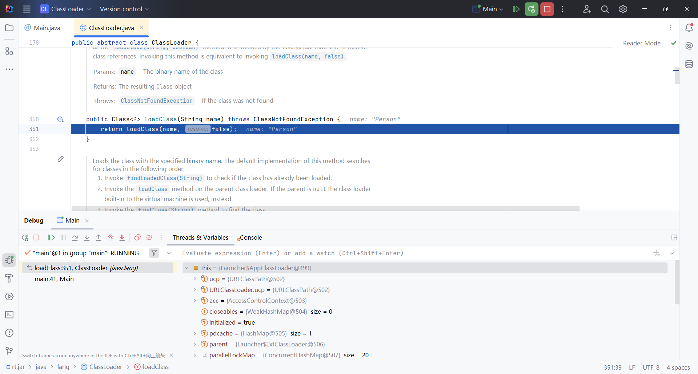
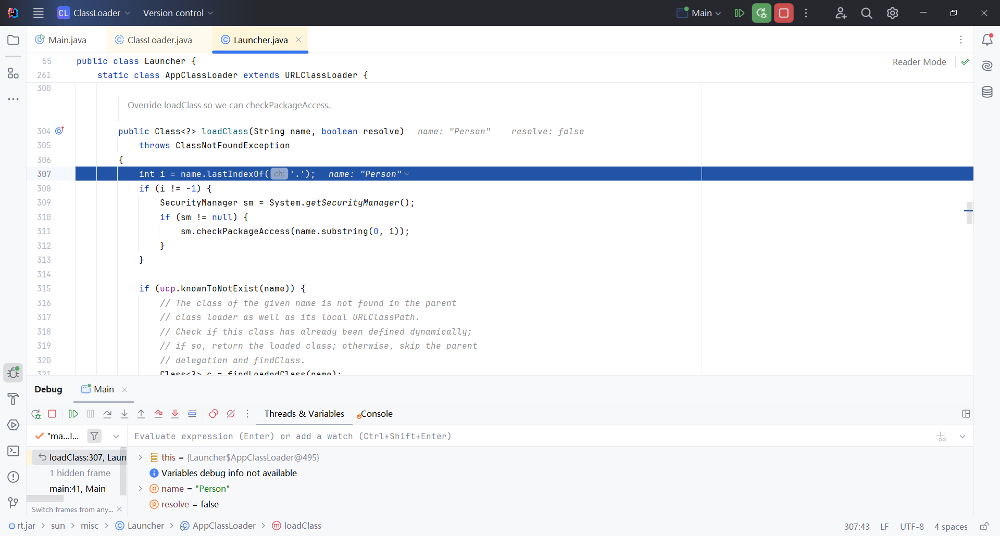
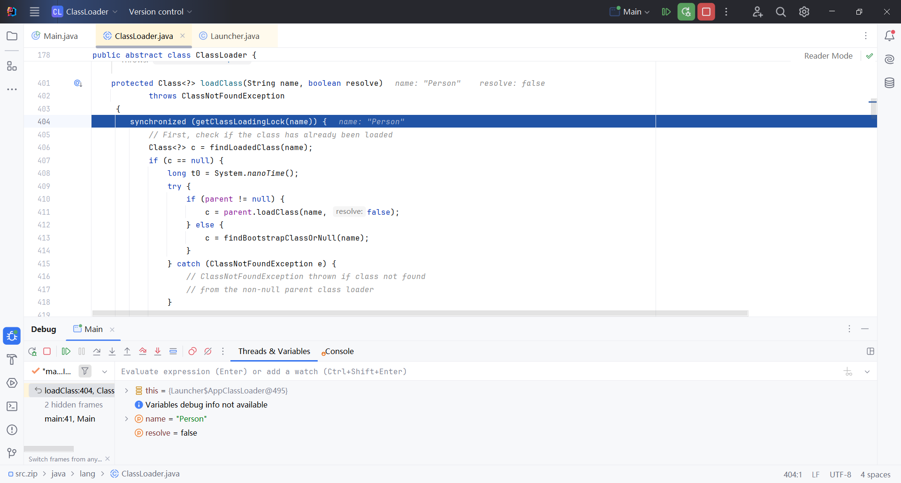
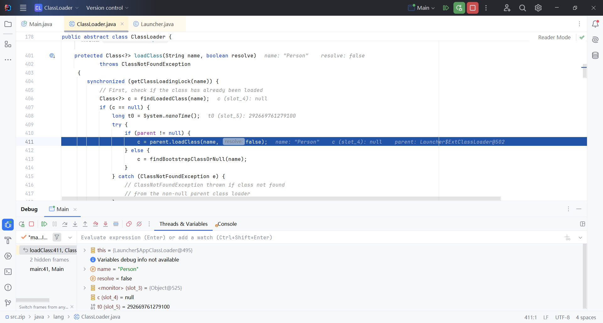
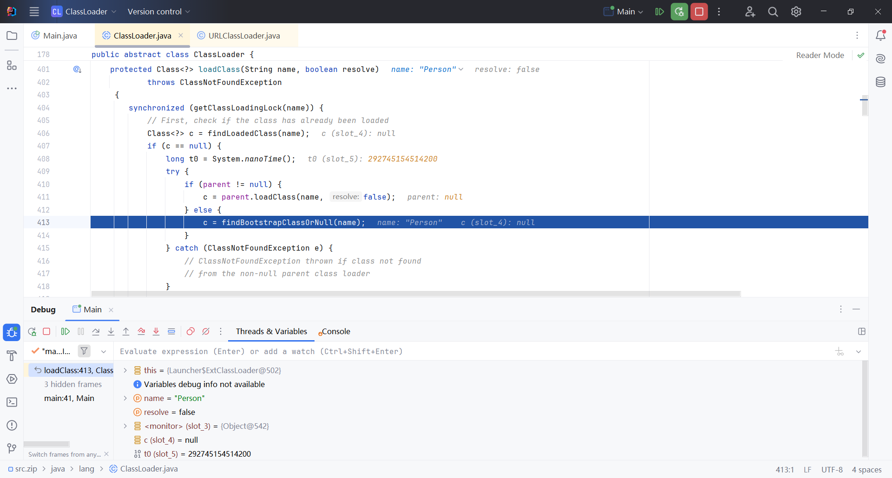
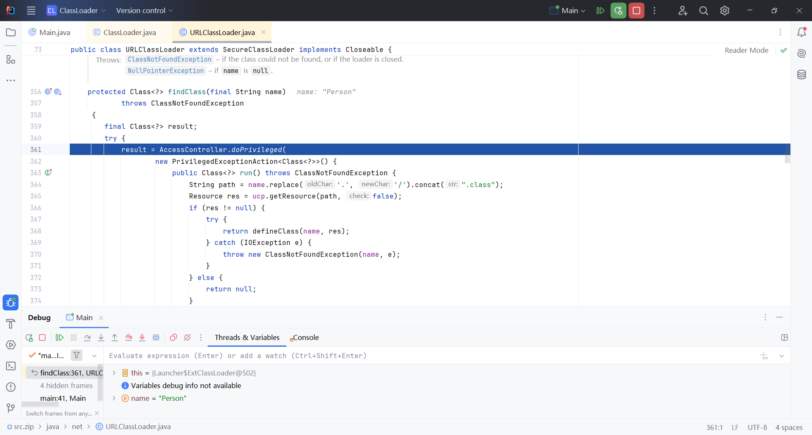
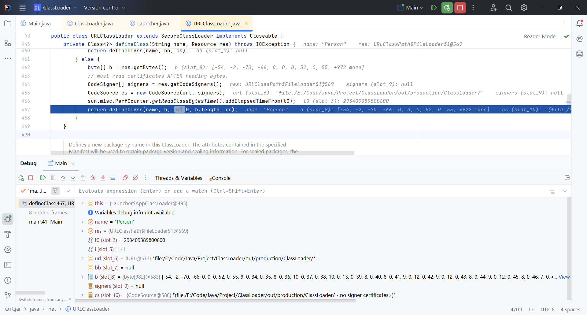
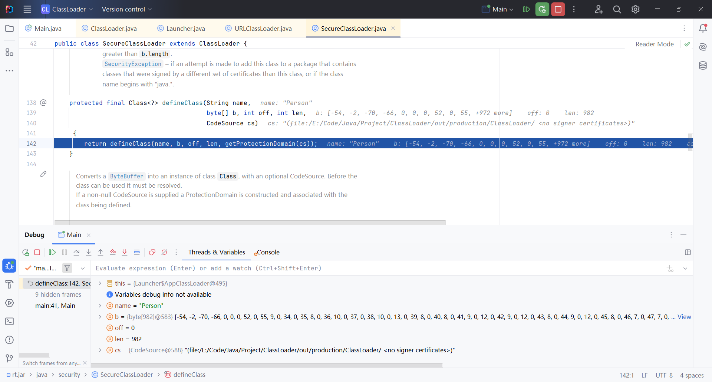

## What is Class Loading?

**Class loading** refers to the process of reading the bytecode of a class (a `.class` file) from sources such as the file system, network, or other locations and converting it into a format that the JVM (Java Virtual Machine) can understand. Class loading is a critical step in the JVM's execution of Java programs, ensuring that a class is correctly loaded into memory before it is used.


## When Does Class Loading Occur?

Class loading typically occurs the first time a class is **actively used**. The following scenarios trigger class loading:

1. **When an instance of the class is created.**
   Example: `new MyClass();`

2. **When accessing static members of the class** (static variables or methods).
   Example: `MyClass.staticMethod();`

3. **When invoking `Class.forName()` to explicitly load the class.**
   Example:

   ```java
   Class<?> clazz = Class.forName("com.example.MyClass");
   ```
   {: .nolineno}
   
4. **When accessing static constants that cannot be determined at compile-time.**
   If a static constant’s value is computed at runtime, the class will be loaded the first time it is accessed.
   Example:

   ```java
   class Person {
       static final int VALUE = calculate();  // Static constant computed at runtime
       static int calculate() { return 5; }
   }
   System.out.println(Person.VALUE);  // Triggers class loading and static initialization
   ```
   {: .nolineno}

5. **When initializing a subclass, which depends on the superclass.**
   If a subclass is initialized and it depends on the parent class's static fields or methods, the parent class is loaded first.
   Example:

   ```java
   class Parent {
       static {
           System.out.println("Parent class loaded.");
       }
   }
   class Child extends Parent {
       static {
           System.out.println("Child class loaded.");
       }
   }
   public class Main {
       public static void main(String[] args) {
           new Child();  // Triggers class loading for both Parent and Child
       }
   }
   ```
   {: .nolineno}

   **Output:**

   ```
   Parent class loaded.  
   Child class loaded.
   ```
   {: .nolineno}

6. **When the JVM starts and loads the main class (the class containing the `main()` method).**

7. **When dynamically generating proxy classes.**
   Proxy classes are generated and loaded at runtime.

8. **When creating an instance of a class via reflection.**
   Example:

   ```java
   Class<?> clazz = Class.forName("com.example.MyClass");
   Object instance = clazz.getDeclaredConstructor().newInstance();
   ```
   {: .nolineno}


**Note**:
Using `Person.class` to get a reference to the `Class` object does not trigger class loading.
Example:

```java
Class<?> clazz = Person.class;  // Does not load the class
```
{: .nolineno}


## How Are Classes Loaded?


### **1. Loading**

- **Description**: The JVM uses a class loader to read the bytecode (`.class` file) from a disk, network, or other sources and loads it into memory. During this phase:
  - The bytecode is converted into a format the JVM can process.
  - A `Class` object is created in the JVM's method area, representing the metadata of the class (class name, methods, fields, etc.).
  - Once completed, the class is marked as "loaded," but no linking or initialization has yet occurred.

### **2. Linking**

This phase transforms the class bytecode into a form directly usable by the JVM. It is subdivided into three steps:

- **Verification**:
  Ensures that the bytecode adheres to the JVM specification and has not been tampered with. For example:

  - Confirms the correct structure of the `.class` file.
  - Verifies that the methods and fields have valid access permissions.
  - If the bytecode fails validation, the JVM throws exceptions like `VerifyError`.

- **Preparation**:

  - Allocates memory for the class's static fields.

  - Initializes static variables to their default values (e.g., `0` for `int`, `null` for objects), not the values specified in the code.
    Example:

    ```java
    static int counter = 100;  // Value assigned in initialization, not here
    ```
  
- **Resolution**:

  - Converts symbolic references (e.g., method or field names) in the constant pool into direct references (e.g., memory addresses).
  - Symbolic references are created during compilation, while direct references are determined during this phase.

### **3. Initialization**

- **Description**: The static variables of the class are assigned their defined values, and static blocks are executed.
  This is the point where the class transitions from being "loaded" to being actively used.
  **Trigger**: Initialization occurs during the class's **active use** (e.g., invoking static methods, accessing static fields).

### **4. Using**

- **Description**: After successful initialization, the class is ready for use. It can now:
- Instantiate objects.
  - Access static or instance fields.
- Invoke static or instance methods.

### **5. Unloading**

- **Description**: When a class is no longer in use and there are no references to it, the JVM unloads it via the garbage collection process.
  - The memory occupied by the `Class` object and the class loader is reclaimed.
  - Unloading occurs automatically; manual unloading of classes is not supported.


## Class Loaders

A **class loader** is a Java component that dynamically loads `.class` files into the JVM and converts them into `Class` objects for execution. The class loader is responsible for fetching class definitions from file systems, networks, or other sources. Every class loader is an instance of the `ClassLoader` class, and Java provides several types of class loaders for different purposes.

### **1. Bootstrap ClassLoader**

- **Role**: The topmost class loader in the hierarchy.
- **Implementation**: Written in native code (usually C++).
- Responsibilities:
  - Loads Java core libraries from the **JDK's `lib` directory** or `rt.jar`.
  - Examples of core classes include `java.lang.String`, `java.util.ArrayList`, etc.
- **Limitations**: Not accessible from Java code. For example, calling `getParent()` on the Bootstrap ClassLoader returns `null`.


### **2. Extension ClassLoader**

- **Role**: Loads classes from the **extension directories** of the JVM.
- **Implementation**: Written in Java.
- Responsibilities:
  - Loads JAR files located in the `jre/lib/ext` directory or any directories specified by the `java.ext.dirs` system property.
  - Examples include additional APIs or libraries that extend the JDK's core functionalities.
- **Usage**: You can retrieve it via `ClassLoader.getParent()` in Java code.


### **3. Application ClassLoader (System ClassLoader)**

- **Role**: The default class loader for user-defined classes.
- Responsibilities:
  - Loads classes from the **application's classpath**, defined by the `CLASSPATH` environment variable or passed to the JVM via `-cp` or `-classpath` options.
  - This loader is used to load most application-level classes.
- **Usage**: This is the default loader when you create Java applications. You can obtain it using `ClassLoader.getSystemClassLoader()`.


### **4. Custom ClassLoader**

- **Role**: Allows developers to define and control their own class-loading logic.

- **Implementation**: Created by extending the `ClassLoader` class and overriding methods such as `findClass()`.

- Use Cases:

  - Loading classes from unconventional sources, such as databases, encrypted files, or remote servers.
  - Implementing custom security policies.

- Example:

  ```java
  public class MyClassLoader extends ClassLoader {
      @Override
      protected Class<?> findClass(String name) throws ClassNotFoundException {
          // Custom logic to locate and define the class
          byte[] classBytes = loadClassData(name);
          return defineClass(name, classBytes, 0, classBytes.length);
      }
  
      private byte[] loadClassData(String name) {
          // Logic to fetch the class bytecode from a custom source
      }
  }
  ```


## Parent Delegation Model

The **Parent Delegation Model** is a convention used by class loaders to load classes. When a class loader receives a request to load a class, it delegates the request to its parent class loader before attempting to load the class itself. Only if the parent class loader fails to load the class does the child class loader attempt to load it.

This mechanism ensures **security and consistency** by preventing custom class loaders from overriding or tampering with core Java classes like `java.lang.Object`.


**How It Works**: 

1. **Class loader receives a load request**: The child class loader receives a request to load a class (e.g., `Person`).
2. Delegation to parent: The child delegates the loading request to its parent class loader.
3. Parent attempts to load the class: If the parent class loader finds the class, it loads it.
4. Fallback to child: If the parent cannot find the class, the child class loader attempts to load it.


**Example**: 

```java
Person person = new Person();  // Loading the Person class
```

1. The **Application ClassLoader** (child) receives the request to load `Person`.

2. It delegates the request to its parent, the **Extension ClassLoader**.

3. The **Extension ClassLoader** further delegates the request to the **Bootstrap ClassLoader**.

4. The Bootstrap ClassLoader attempts to load `Person`:
   - If successful, it loads the class.
   - If not, control returns to the **Extension ClassLoader**.

5. The Extension ClassLoader then attempts to load `Person` :
   - If successful, it loads the class.
   - If not, control returns to the **Application ClassLoader**.

6. The **Application ClassLoader** finally attempts to load and succeeds in loading the `Person` class.


**Why It Matters**: 

1. **Core Library Integrity**: Ensures that core Java classes like `java.lang.String` or `java.util.List` are always loaded by the **Bootstrap ClassLoader**. Prevents malicious or incorrectly defined custom classes from overriding core libraries.
2. **Security**: Avoids potential vulnerabilities by ensuring the JVM’s core classes remain untampered.
3. **Consistency**: Prevents duplication of class definitions and ensures that shared classes are loaded only once by the appropriate class loader.


## Why is the Parent Delegation Model Necessary?

The **Parent Delegation Model** is essential to ensure **security, consistency, and efficiency** in the Java class-loading process. Its primary purpose is to **protect the integrity of Java's core libraries** and prevent them from being tampered with or overridden.


**Avoid Duplicate Loading**:

- Core classes like `java.lang.Object` are loaded **only once** by the **Bootstrap ClassLoader**, ensuring that all Java classes in the JVM share the same foundational classes.
- Without this mechanism, different custom class loaders could create multiple, inconsistent versions of the same core class, leading to unpredictable behavior.


**Prevent Security Risks**:

- Protects against malicious or accidental redefinition of critical system classes.
- For example, consider a custom `java.lang.String` class loaded via a custom class loader:

```java
package java.lang;

public class String {
    public String() {
        System.out.println("I am a fake String class!");
    }
}
```

Without the delegation model, the JVM might load this fake `String` class instead of the legitimate one from the core libraries, causing severe security and stability issues. The delegation model ensures the **Bootstrap ClassLoader** always loads core classes first, avoiding such conflicts.


**Maintain Class Consistency Across the JVM**: Ensures that all Java components use the same trusted implementation of system classes, avoiding incompatibilities and runtime errors.


**Simplify the Class Loading Process**: Delegating to a parent class loader reduces the complexity for child class loaders. The parent handles most of the class-loading tasks, leaving the child to focus only on loading specific application-level or custom classes.


### **Illustrative Example**

Imagine an application using a fake `java.lang.String` defined by a custom class loader:

```java
package java.lang;

public class String {
    public String() {
        System.out.println("This is not the real String class!");
    }
}

public class Main {
    public static void main(String[] args) {
        String fake = new String();
    }
}
```

If the JVM didn't enforce the delegation model, this fake `String` class might be loaded instead of the core library version, leading to:

```
Output: This is not the real String class!
```

However, thanks to the Parent Delegation Model, the `Bootstrap ClassLoader` ensures that the legitimate `java.lang.String` from the core libraries is always loaded first, preventing such problems.


## Debugging and Analyzing the Class Loading Process

```java
public class Main {
    public static void main(String[] args) {
        ClassLoader classLoader = ClassLoader.getSystemClassLoader();
        System.out.println(classLoader);  // sun.misc.Launcher$AppClassLoader
        Class<?> person = classLoader.loadClass("Person");
        person.newInstance();
    }
}
```

Set a breakpoint at `Class<?> person = classLoader.loadClass("Person");` to start debugging.

First, when you enter the `loadClass()` method, you will see that the program proceeds to the `ClassLoader.loadClass()` method.

There is a question here: Shouldn't the program have entered `AppClassLoader.loadClass()`? Why did it enter here instead?

The reason is that the `AppClassLoader` class does not implement the `loadClass(String name)` method from its parent class `ClassLoader`, so it defaults to calling the `loadClass()` method in the `ClassLoader` class, which then calls the `loadClass(name, false)` method in the `AppClassLoader` subclass.



We then enter the `return` statement in the `AppClassLoader.loadClass(name, false)` method.



After going through some security checks, the program proceeds to `return super.loadClass(name, resolve);`, calling the parent class's `ClassLoader.loadClass(String name, boolean resolve)` method, and enters this method. The method first executes `getClassLoadingLock(name)`, where the `name` parameter is `Person`, which is used to acquire the lock object for loading the specified class name.



Next, it executes `findLoadedClass(name)` to check whether the class has been loaded by the current class loader instance. If the class has not been loaded, it returns `null`; if the class has been loaded, it returns the corresponding `Class<?>` object. Since the `Person` class has not been loaded, it returns `null`. Then, it enters the `c == null` check, followed by the `try` statement that checks whether `parent` is `null`, which refers to the parent class loader. If the parent class loader is not `null`, the load request is delegated to the parent class loader. It attempts to load the class via `parent.loadClass(name, false)`, and here we can see that the load request is delegated to the parent class loader `ExtClassLoader`.



When entering `parent.loadClass(name, false)`, it actually performs the same operations as before: checking whether the class has been loaded in the `ExtClassLoader`. Since it hasn't, it returns `null`, and then checks if `parent` is `null`. (Since the `BootstrapClassLoader` is written in C++ and is not part of Java, here `parent` is `null`.) Therefore, the program proceeds to the `findBootstrapClassOrNull(name)` method. In this method, it checks whether the class name is valid by verifying if `name` is illegal. The result is `true`, meaning the class name is valid, and it returns `null`.



Since the value of `c` is `null`, the program continues into the next `if` statement. Within this, there is a call to `findClass(name)`. Entering this method, we find that it calls `URLClassLoader.findClass(final String name)`.



At the beginning of the method, a temporary elevation of privileges is performed in order to execute privileged operations. Then, the program reaches the following two statements:

```java
String path = name.replace('.', '/').concat(".class");  // path = "Person.class"
Resource res = ucp.getResource(path, false);
```

Here, the class name is converted into a path format, and then the program uses `ucp`, which is an instance of `URLClassPath`, to look up the corresponding `.class` file. This returns a `Resource` object, where `res.url` is the path of the `Person` class.

Since `res` is not `null`, the program continues executing the `if` statement and attempts to invoke the `URLClassLoader.defineClass(name, res)` method. This method is used to read the class bytecode and convert it into a `Class` object, and finally, it returns `defineClass(name, b, 0, b.length, cs)`.



Entering this return value, the program proceeds to the `SecureClassLoader.defineClass(String name, byte[] b, int off, int len, CodeSource cs)` method. The `defineClass` method is called, passing the byte array along with its offset and length as parameters, and combining this with the class's protection domain (`ProtectionDomain`) to complete the class definition. This ensures that only code with the appropriate permissions can access the defined class. Finally, it returns the `Class` object loaded from the bytecode.



Our exploration of the class loading mechanism through the code ends here. The remaining steps involve performance monitoring during class loading and determining whether to resolve (`resolve`). Finally, it returns the `Class` object of the `Person` class.


**Summary**:

The inheritance hierarchy of the required classes during the class loading process is as follows:

```
ClassLoader -> SecureClassLoader -> URLClassLoader -> ExtClassLoader & AppClassLoader
```

From the perspective of understanding the mechanism, the key methods to observe are actually three main methods:

```
loadClass() -> findClass() -> defineClass()
```

- `loadClass()`: Used to load a class and return a `Class` object.
- `findClass()`: Used to locate the class's bytecode.
- `defineClass()`: Used to convert the bytecode into a `Class` object.

From a security perspective, the most important core is the `defineClass()` method. Using this method, we can load the bytecode of any malicious class and instantiate it to create a malicious `Class` object, potentially causing an attack on the target.