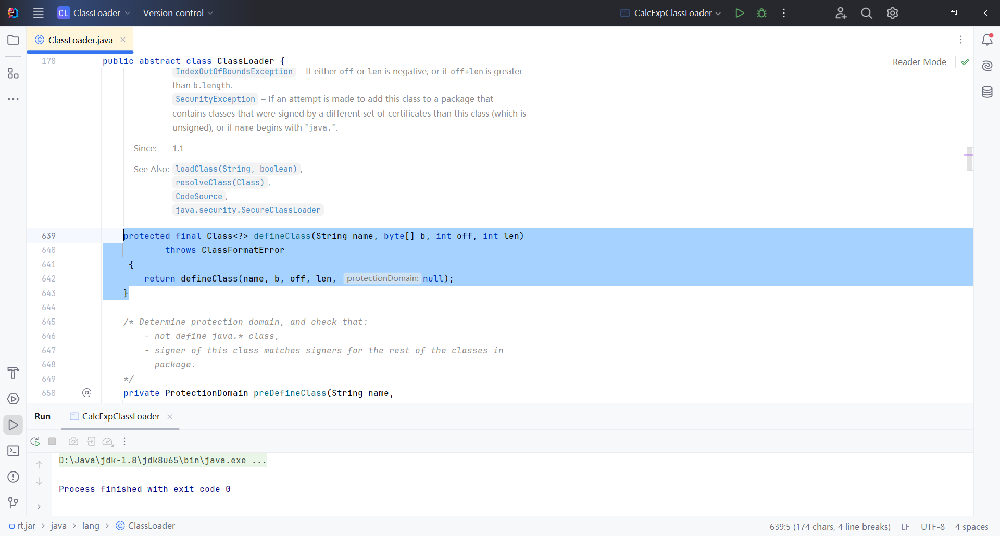
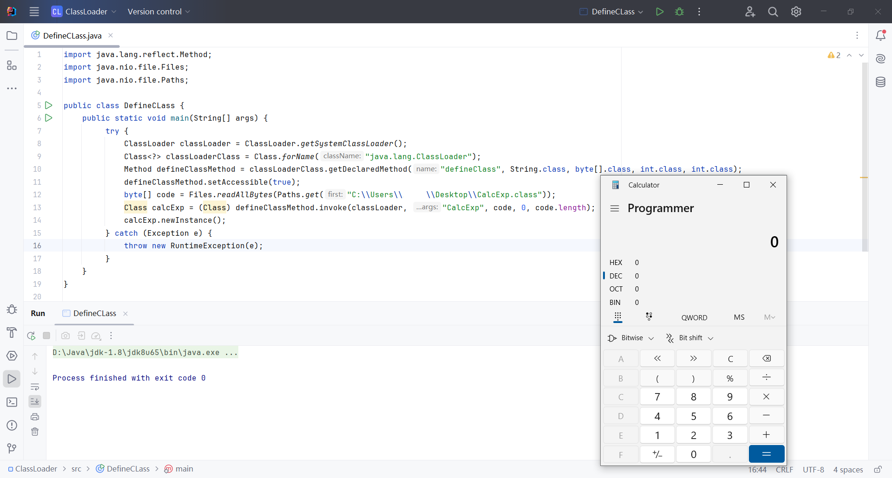

## Using ClassLoader to Load Bytecode

The core method for class loading is `ClassLoader.defineClass()`, which converts a located class bytecode file into a `Class` object.

```java
protected native final Class<?> defineClass(String name, byte[] b, int off, int len, ProtectionDomain protectionDomain);
```
{: .nolineno}


`ClassLoader#defineClass` is a `native` method implemented at the JVM level in C/C++. This method takes bytecode from a byte array or `ByteBuffer` and converts it into a `Class` object, making the bytecode understandable to the JVM.

In Java's `ClassLoader` class, the `defineClass()` method we see in IDEs like IntelliJ IDEA is an overloaded, `protected` version. It internally calls the native implementation. The method's parameters include:

- **`name`**: The name of the class.

- **`b`**: The byte array containing the class bytecode.

- **`off`**: The starting offset in the byte array.

- **`len`**: The length of the bytecode in the array.



Since `defineClass()` is marked as `protected`, it cannot be accessed directly from outside. To overcome this, reflection is used to invoke the method and load arbitrary bytecode.

```java
import java.lang.reflect.Method;
import java.nio.file.Files;
import java.nio.file.Paths;

public class DefineClass {
    public static void main(String[] args) {
        try {
            // Obtain the system class loader
            ClassLoader classLoader = ClassLoader.getSystemClassLoader();

            // Reflectively get the defineClass method from the ClassLoader class
            Class<?> classLoaderClass = Class.forName("java.lang.ClassLoader");

            // Retrieve the defineClass method with parameters: String, byte[], int, int
            Method defineClassMethod = classLoaderClass.getDeclaredMethod("defineClass",
                    String.class, byte[].class, int.class, int.class);

            // Set defineClass method accessible, as it is protected
            defineClassMethod.setAccessible(true);

            // Read the .class file's bytecode from a specified path
            byte[] code = Files.readAllBytes(Paths.get("C:\\Users\\xxx\\Desktop\\CalcExp.class"));

            // Invoke the defineClass method reflectively
            Class calcExp = (Class) defineClassMethod.invoke(classLoader, "CalcExp", code, 0, code.length);

            // Instantiate the class
            calcExp.newInstance();
        } catch (Exception e) {
            throw new RuntimeException(e);
        }
    }
}
```
{: .nolineno}



Since `defineClass` is a `protected` method, it cannot be called directly under normal circumstances. By using reflection and `setAccessible(true)`, access control checks can be bypassed. However, this approach might trigger Java's security mechanisms, especially when a `SecurityManager` is active. The `defineClass` method is typically not exposed to external access, making its exploitation challenging in real-world attack scenarios. Additionally, if the class loader is tightly controlled, injecting malicious bytecode through this method becomes even more difficult.

