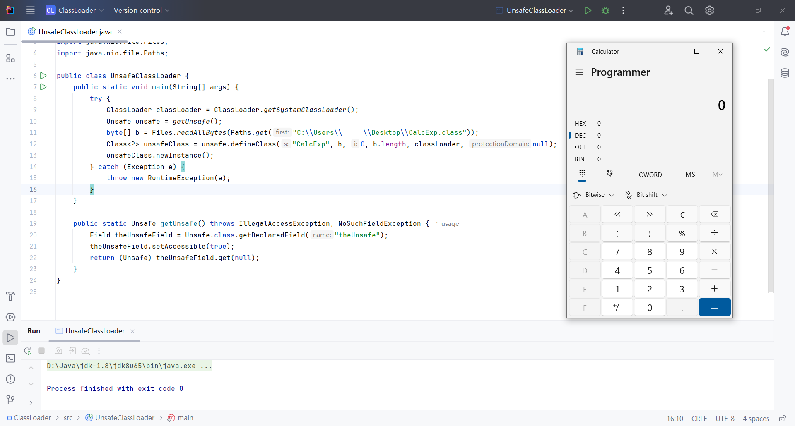

## Using Unsafe to Load Bytecode

The `Unsafe` class provides services through a singleton pattern and cannot be instantiated via `new`. Its instance is managed through a private static variable.

```java
private static final Unsafe theUnsafe = new Unsafe();
```

The method to obtain the `Unsafe` instance is `getUnsafe()`, but this method has strict permission restrictions. If the current class loader is not the Bootstrap ClassLoader, calling `getUnsafe()` will throw a `SecurityException`, preventing direct access to `Unsafe`.

```java
public static Unsafe getUnsafe() {
    SecurityManager sm = System.getSecurityManager();
    if (sm != null) {
        sm.checkPermission(new RuntimePermission("accessClassInPackage.sun.misc"));
    }
    return theUnsafe;
}
```

Although direct instantiation of `Unsafe` is restricted, we can bypass this restriction using reflection to obtain the `Unsafe` instance.

```java
import sun.misc.Unsafe;
import java.lang.reflect.Field;

public class UnsafeClassLoader {
    public static void main(String[] args) {
        Unsafe unsafe = Unsafe.getUnsafe();
    }

    public static Unsafe getUnsafe() throws IllegalAccessException, NoSuchFieldException {
        Field theUnsafeField = Unsafe.class.getDeclaredField("theUnsafe");
        theUnsafeField.setAccessible(true);
        return (Unsafe) theUnsafeField.get(null);
    }
}
```

Once the `Unsafe` instance is obtained, we can call the `defineClass()` method of `Unsafe` to bypass the normal class loading mechanism and directly define a class. This method allows us to convert malicious class bytecode into a `Class` object, which can then be instantiated to attack the target.

```java
public native Class<?> defineClass(String name, byte[] b, int off, int len, ClassLoader loader, ProtectionDomain domain);
```

The parameters for this method include `name`, the name of the class to load, `b`, the bytecode array, `off`, the starting position in the bytecode array, `len`, the length of the bytecode array, `loader`, the class loader to load the class into, and `domain`, the protection domain (usually passed as `null`).

```java
import sun.misc.Unsafe;
import java.lang.reflect.Field;
import java.nio.file.Files;
import java.nio.file.Paths;

public class UnsafeClassLoader {
    public static void main(String[] args) {
        try {
            ClassLoader classLoader = ClassLoader.getSystemClassLoader();
            Unsafe unsafe = getUnsafe();
            byte[] b = Files.readAllBytes(Paths.get("C:\\Users\\xxx\\Desktop\\CalcExp.class"));
            Class<?> unsafeClass = unsafe.defineClass("CalcExp", b, 0, b.length, classLoader, null);
            unsafeClass.newInstance();
        } catch (Exception e) {
            throw new RuntimeException(e);
        }
    }

    public static Unsafe getUnsafe() throws IllegalAccessException, NoSuchFieldException {
        Field theUnsafeField = Unsafe.class.getDeclaredField("theUnsafe");
        theUnsafeField.setAccessible(true);
        return (Unsafe) theUnsafeField.get(null);
    }
}
```

